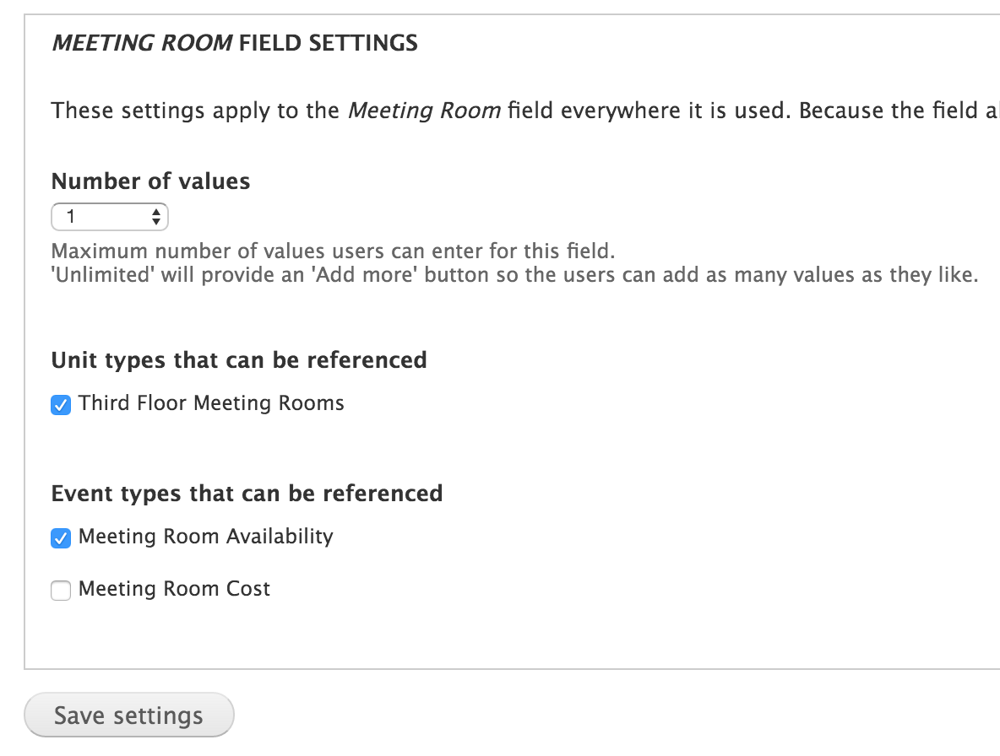
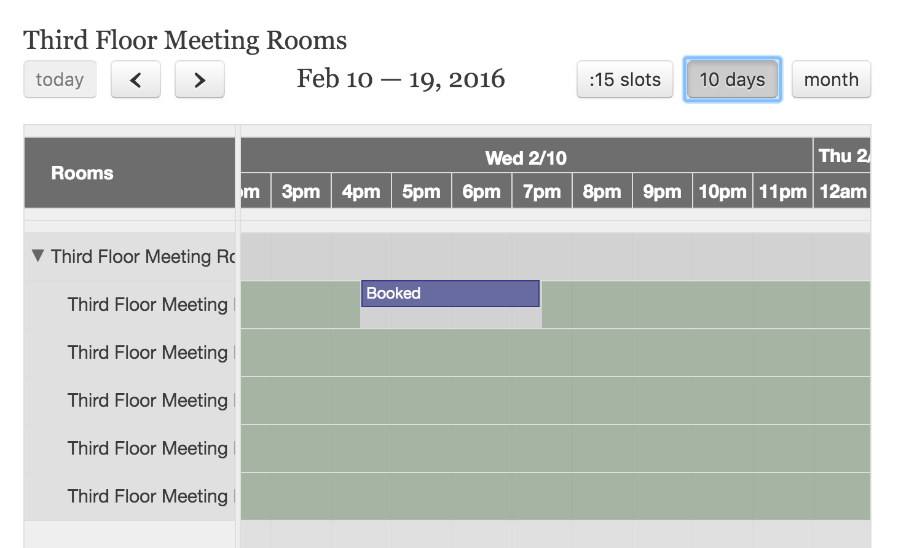
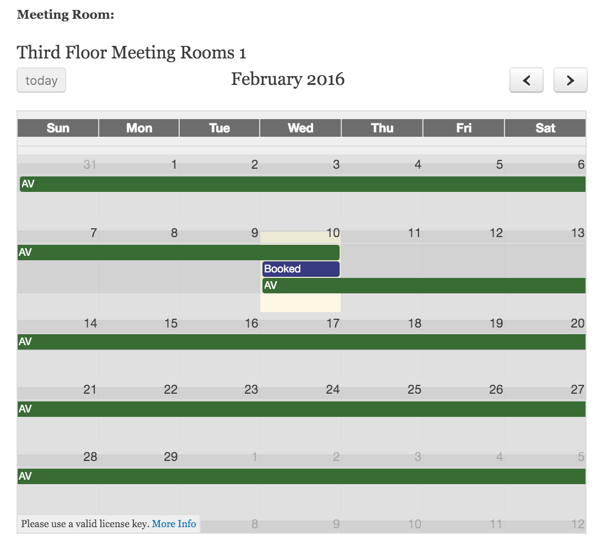

.. _bat_drupal_displaying_availability:

Displaying Availability
************************

To display availability on the front-end of your Drupal site there are two fields you can use which are provided by the BAT Calendar Reference module included in the BAT project.

BAT Calendar Unit Reference
----------------------------
Allows you to reference one or more units, for a certain Type and Event Type

BAT Calendar Unit Type Reference
---------------------------------
Allows you to reference on or more Types for a certain event type

The fields allow you to display either a Scheduler-style timeline or a calendar view by editing 

Timeline View
-------------

Agenda / Month View

