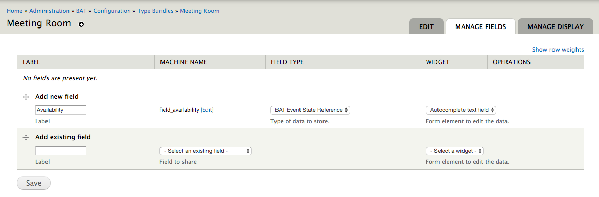
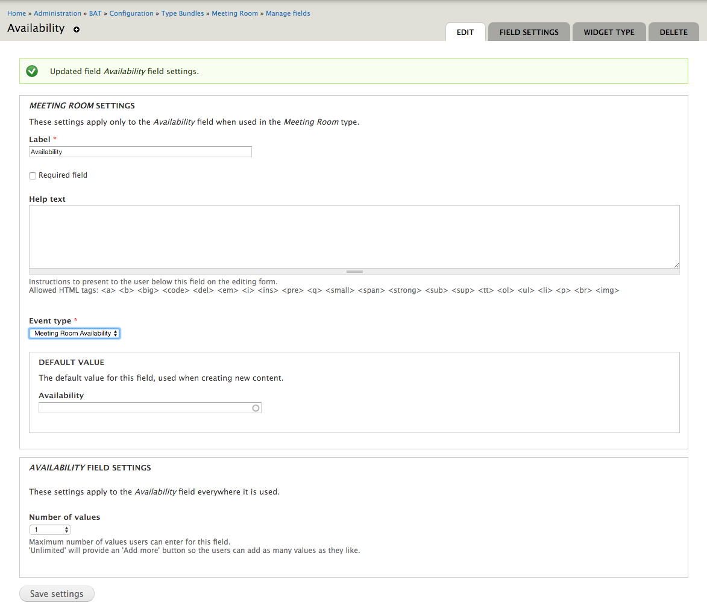
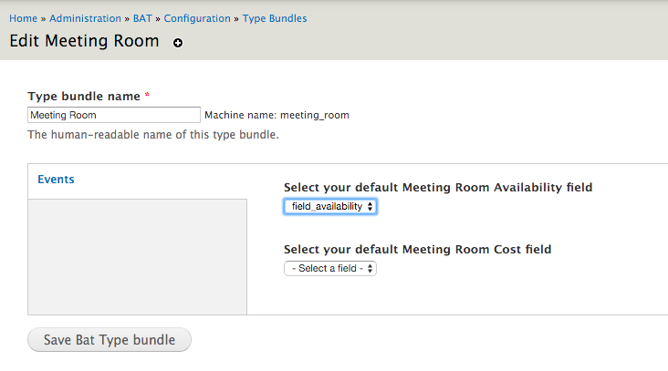
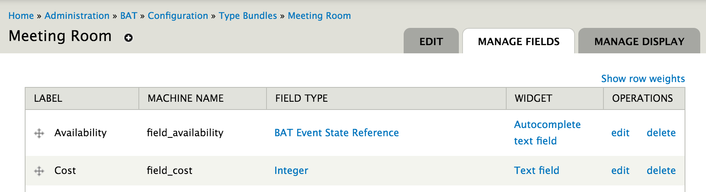
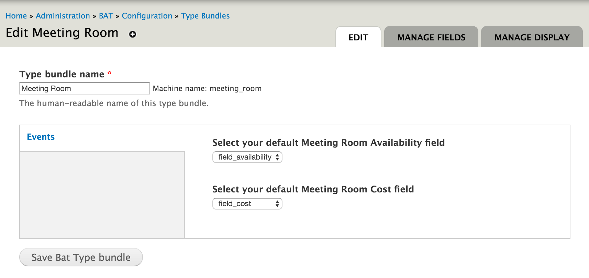

.. _bat_drupal_event_types:

Connect Types to Events
************************

In BAT we try to have the least possible amount of things hard-coded. This allows us to create truly flexible booking systems. However, it also means that we need to *explain* all these connections to the framework.

In :doc:`type_bundles` we created a Meeting Room Type and in :doc:`events` we created two types of events for availability and pricing. We now have to connect the two. In other words, we need to let BAT know that our meeting rooms will have events of the type Meeting Room Available and Pricing *happen* to them.

Default event value fields
===========================
To connect a Type Bundle to an Event you first have to add a default event value field.

In ``admin/bat/config/type-bundles`` click on the "manage fields" operation of the type you are interested in and add fields to hold default event values.

Fixed State Events
-------------------
For fixed state events the type of field is always going to be BAT Event State Reference field.

In the field settings you need to select the Event Type that this field will point to (it will only show event types that have fixed states).

Now, with the field in place you can visit ``bat/config/type-bundles`` and click on the "edit" operation of the type bundle you are interested in. For every type of Event you will see a drop-down that allows you to connect a field of this Type Bundle to an Event Type.

This may seem like an extra step but you should keep in mind that BAT makes no assumptions. You may have multiple Fixed State event fields pointing to multiple event types. As a result, there is a bit of extra setup to define everything.

Arbitrary state events
-----------------------
For arbitrary state events you can create a field out of the set of fields that BAT supports. Currently those are:

* Integer
* Commerce Price
* Text

#. The first step is to create the field - in our example we will create an Integer field that will hold the cost.

#. We can now (under the Edit tab) link the Cost field to the Meeting Room Cost even type

As we mentioned before we can only handle a certain amount of fields for arbitrary values. 

Now, at this point all that has happened is that BAT can:

* Connect unit types to event types
* Store the right information regarding availability and cost (because these are the event types we defined)

You need to create types (see :doc:`types`) and then in :doc:`manage_units` we explain how these types can be manipulated and values changed over time.

