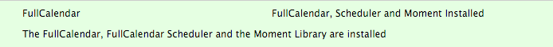
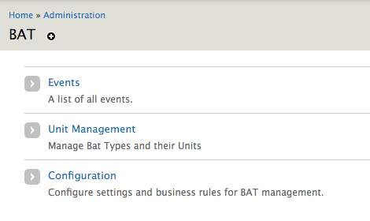

.. _bat_drupal_installation:

Installation
************
Assuming you have all the dependencies in place as described in :doc:`requirements` you can now proceed to activate the BAT modules and get setup.

Activate Modules
-----------------
Visit ``admin\modules\`` and activate the following modules:

* BAT - Booking and Availability Management Tools
* BAT Event
* BAT Event UI
* BAT Fullcalendar
* BAT Unit
* Booking and Availability Tools API
* Composer Manager (this needs to activated explicitly as it is not strictly a BAT dependecy)

Once you confirm installation Drupal will request all the dependencies to these modules. Provided that they are all already downloaded you can simply continue. If something is missing cancel the process, download the missing modules and then continue.

Install BAT PHP Library
-----------------------
Provided that you are using Composer Manager, X Autoload and have Composer you should now have a composer.json file written in ``/sites/default/files/composer``. You can change this location and where the PHP Library will be downloaded by visiting ``admin/config/system/composer-manager/settings`` and setting the Vendor Directory to a location of your choosing.

Now, visit ``/sites/default/files/composer`` on the command line and run ``composer install`` (this assumes that you have already setup Composer for your development environment - if not follow the `information here <https://www.drupal.org/project/composer_manager>`_)

Install the FullCalendar Libraries
------------------------------------
#. Download `Fullcalendar <https://github.com/arshaw/fullcalendar/releases/download/v2.6.0/fullcalendar-2.6.0.zip>`_ and unpack in ``sites/all/libraries/``. You should have a structure similar to ``libraries/fullcalendar/``.
#. Download `Fullcalendar Scheduler <https://github.com/fullcalendar/fullcalendar-scheduler/releases/download/v1.2.0/fullcalendar-scheduler-1.2.0.zip>`_ and unpack in ``sites/all/libraries/``. You should have a structure similar to ``libraries/fullcalendar-scheduler/``.

jQuery Version
---------------
Visit ``admin/config/development/jquery_update`` and ensure that the default jQuery version for your admin theme as well as the site overall is at least 1.10. 

Verify Setup
-------------
Once setup is completed you should see in ``admin/report/status`` the following

*  Composer Manager

.. image:: images/composermanager.png

*   FullCalendar

*   Finally, in ``admin/bat`` you should have

We are now ready to get setup!

