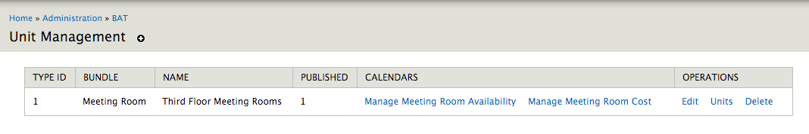

.. _bat_manage_units:

Manage Units
*************

Once you have:

#. Created Type Bundles - :doc:`type_bundles`
#. Create Event Types - :doc:`events`
#. Connected Events to Type Bundles - :doc:`events_types`
#. Created at least one Type - :doc:`types`

you can now go ahead and actually manage your units!

Visit `admin/bat/unit-management`.

