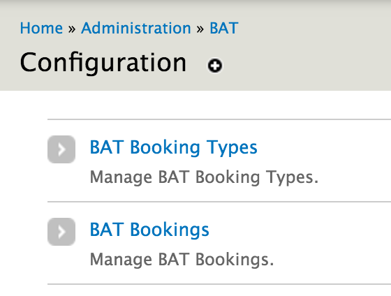
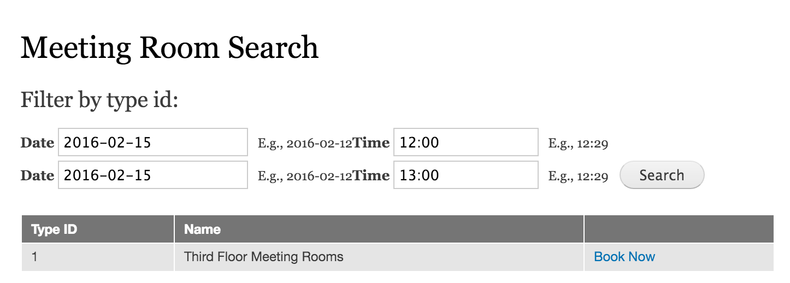

.. _bat_drupal_bookings:

Taking Bookings
****************

With the ability to search for availability (:doc:`search_availability`).

The simplest way to create a booking is to change the state of an event to booked as described in :doc:`manage_units`. This can either be achieved through the Event Management interface or programmatically. 

However, more sophisticated applications may require different interaction modes. One that allows us to connect a Booking to an order / payment, collect additional user information and place it in the context of a checkout flow. In this cases we need an additional degree of separation from Events.

This is the method we are using for our own products and it is described here to help others consider the possibilities when using BAT Drupal. The code for this is really specific to an application so it is not included in BAT Drupal. Please `get in touch <a href="https://roomify.us/get-started">`_ if you are interested in commercial services in this direction. 

Booking Entity
---------------
The first step is to create a Booking Entity. The purpose of this entity is to connect an Event to a Booking and any information that may be associated with that Booking (customer profile, order, etc).

As with everything else in BAT we can have different booking types of different scenarios, etc.

Add Booking Link
----------------
On our Meeting Room View we will add a Book Now link. The Book Now link will only appear following a search and takes into account the values entered in the facet filter. The link passes those on to a basic booking form.

Booking Form
-------------
The booking form can have any fields we may require - in this case we just add a "Confirm Booking" button that will:

#. Re-check availability 

#. Create an event that sets the availability of a meeting room to booking

#. Create a booking entity

.. image:: images/booking-form.png

Depending on the use case one could delay the creation of the Event to after a checkout process.

Bookings
---------
We now have a Booking that is connected with the relevant event. We can use this entity to add any other type of information that is required with the booking and we need to take care to update the relevant event when the booking is changed.

.. image:: images/example-booking.png

