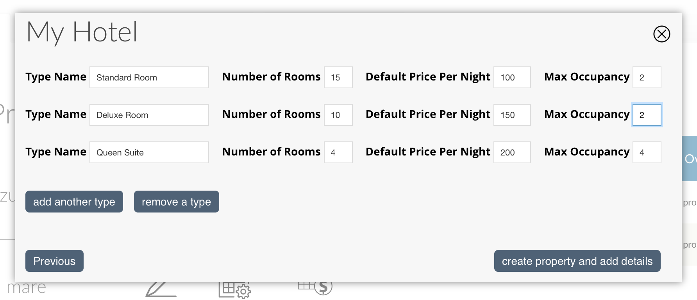

.. _roomify_casa_properties_properties:

**********
Properties
**********

Your dashboard Properties view provides a central place to manage property or properties.  Use this view to:

#. `Create a Property`_
	a. `Single Unit Property`_
	b. `Multi Unit Property`_
#. `Manage Properties`_
	a. `View`_
	b. `Edit`_
	c. `Manage Availability`_
	d. `Manage Pricing`_
	e. `Manage Rooms`_

Create a Property
=================

Creating a property is done from within your dashboard.  If you have permission to add a property, you will see the 'add property' button, as shown in the screenshot below.

Click on 'add property'. You will be asked for the name of the Property, and asked to select the type of property:

+ `Single Unit Property`_

	A single unit property is a property that can only be booked as a whole. The most common type of single unit property is a Vacation Rental.  The rental property may have 1, 2, or even 12 bedrooms, but a booking is made for the whole property.

+ `Multi Unit Property`_

	A multi unit property is a property with multiple individually bookable rooms. Both B & B's and Hotels are multi unit properties.

Single Unit Property
--------------------
To create a single unit property, enter the name of the property, select 'Single Unit (Entire Home)', and click 'next'. You will then be asked to define the maximum number of occupants, and the default nightly rate:

Click on 'Create property and add details' - this will create your property and direct you to the property management interface: `Manage Properties`_

Multi Unit Property
-------------------

To create a multi unit property, enter the name of the property, select 'Multi-Unit (multiple rooms / types within a property)', and click 'next'.

.. image:: images/multi_unit_1.png
   :width: 600 px
   :align: center

You will be asked to enter the type name, number of rooms, default price per night, and max occupancy, for each of your room types.  If you have a B&B, it will look something like this:

A hotel might look more like this:

When you have finished adding your room types (don't worry, you can always add more later), click on 'Create property and add details' - this will create your property and direct you to the property management interface: `Manage Properties`_

Manage Properties
=================

Every property has five tabs:

1. `View`_
2. `Edit`_
3. `Manage Availability`_
4. `Manage Pricing`_
5. `Manage Rooms`_

View
----

Click on this tab to see how your property is displayed on the site.

Edit
----

A Property has several categories of information associated with it:

1. `Basic Information`_
2. `Image Gallery`_
3. `Policies`_
4. `Amenities`_
5. `Location`_
6. `Highlight`_

Basic Information
~~~~~~~~~~~~~~~~~

*Owner*
	The owner field controls determines whether or not the Name and Image on the Property Owner Profile appear on your property listing. To display this information, enter your user id in the field.

.. Add link to docs for creating owner profile

*Property Description*
	The property description is displayed in the 'Overview' tab at the bottom of your property page.

*Property Short Description*
	The property short description is shown below the Image Gallery at the top of your property page.

*Search/Featured Image*
	This image is used in search results, and anywhere your property is featured on the site.  It will *not* appear in the image gallery.  After uploading an image, click on 'manage image crops' (next to the 'Remove' button), and select a crop area for each image style.

Image Gallery
~~~~~~~~~~~~~~~

Each image in your gallery can have an optional title and caption, both will overlay the bottom portion of the image.

*Title*
	This is the title of the image.

*Alternate text*
	This is the image description.  It be displayed underneath the image title, as well as being used by screen readers, and anywhere the image cannot be displayed.

To add an additional image, simply click on 'Choose File' in the 'Add a new file' section, select a file from your computer, and click 'Upload'.

Policies
~~~~~~~~

Any information about policies or rules should be specified here.  This will be displayed in the tab 'Policies', at the bottom of your property page.  If this field is left empty, the tab will not be displayed.

Amenities
~~~~~~~~~

Amenities can be added by clicking in the field and selecting an amenity. You can select additional amenities by clicking again, next to the previously selected item.  If the amenity you are looking for is not in the list, type the name (such as 'High Speed Internet'). A box will appear with the text: 'The term 'High Speed Internet' will be added', click on the box to create the amenity and add it to your property.

Location
~~~~~~~~

*Area*
	The area is used in searches to narrow down a list of properties by area. Areas can be added by clicking in the field and selecting an area. You can select additional areas by clicking again, next to the previously selected item.  If the area you are looking for is not in the list, type the name (such as 'New York City'). A box will appear with the text: 'The term 'New York City' will be added', click on the box to create the area and add it to your property.

*Area Type*
	The area type is another way of categorizing a property, and is generally used on large sites with many different properties. An example of an area type is 'Beachfront'. Area types can be added by clicking in the field and selecting an area type. You can select additional area types by clicking again, next to the previously selected item.  If the area type you are looking for is not in the list, type the name (such as 'Lakefront'). A box will appear with the text: 'The term 'Lakefront' will be added', click on the box to create the area type and add it to your property.

.. *Location*

Highlight
~~~~~~~~~

Highlights are used to showcase features of your property.  This could be rooms in your vacation rental or B & B, or special features of your Hotel, such as a swimming pool.

.. *Highlight Intro*

Manage Availability
-------------------
Manage Pricing
--------------
Manage Rooms
------------

