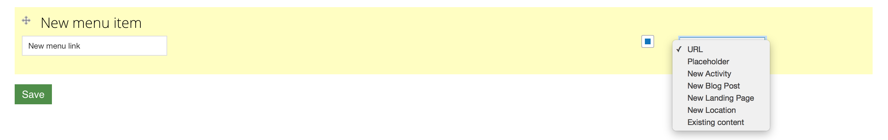

.. _roomify_accommodations_content_menu:

Manage Main Menu
****************

The main menu of your site is the primary navigation tool for your users. You can :

#. `Re-order Menu items`_
#. `Create new menu items`_
#. `Delete a menu item`_

Re-order Menu items
===================

Re-ordering menu items is a simple as dragging and dropping.

Click on the gray arrows next to a menu link, and drag it to a new position.  Click 'Save'.

Create new menu items
=====================

Creating a new menu item is easy!  Type in the name of your new link in the box, (for example, in the image, the new menu link is "New menu link"), select the appropriate target, and click 'Save'.

There are several choices available when creating a new menu link:

+ `Url`_
+ `Placeholder`_
+ `New Activity/Blog Post/Landing Page/Location`_
+ `Existing Content`_

URL
---

A URL menu link can be used to link to any internal or external page. Fill in the 'Path' field with an internal, relative link (for example, 'contact'), or an external link, with the full url (for example, 'https://roomify.us').

.. image:: images/menu_new_url.png
   :width: 600 px
   :align: center

Placeholder
-----------

A placeholder menu link is exactly what it sounds like, and will display a non-clickable menu item.

New Activity/Blog Post/Landing Page/Location
--------------------------------------------

These options will create a new piece of content, of the type chosen. Fill in the appropriate fields for the content type chosen, and click 'Save'. This will create the content, associate it with your new menu link, and return you to the menu's editing interface.

Existing Content
----------------

When you create a new menu item and select 'existing content', you will be taken to a screen that displays any site content that a link can be created for. You can search by Title, and filter by content type.  When you have found the content that you wish to create a link to, click on 'select'.  The menu link will be created, and you will be returned to the menu's editing interface.

.. image:: images/menu_existing_content.png
   :width: 600 px
   :align: center

Delete a menu item
==================

To delete a menu item, click on the arrow in the 'Operations' for that link, and select 'delete item'.  You will be presented with a confirmation screen.  If you actually wanted to delete the menu item, click on 'Confirm', otherwise you can cancel the deletion.

.. image:: images/menu_delete_item.png
   :width: 200 px
   :align: center

