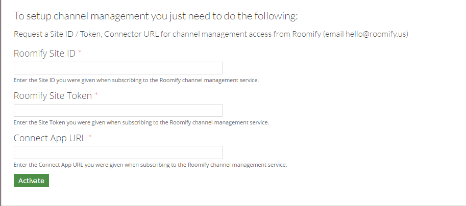
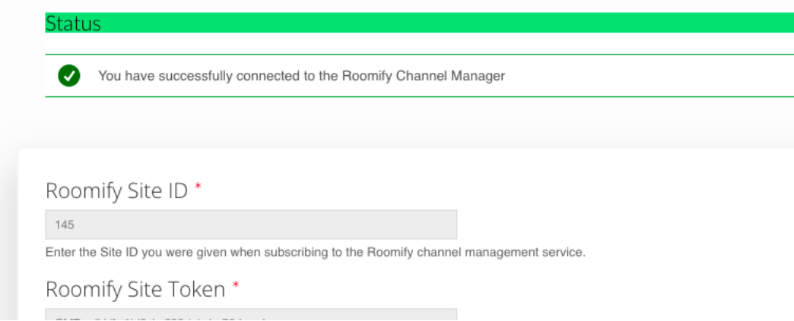
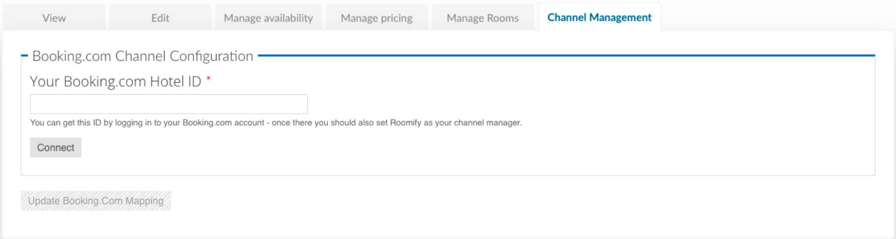
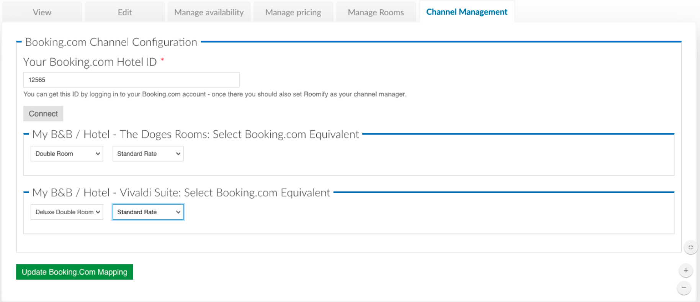

.. _roomify_accommodations_channel_management:

Channel Management
******************
The Roomify Channel Management service allows you to connect one or more properties and sync with:

+ booking.com - 2-way full
+ airbnb.com - iCal-based
+ Homeaway / VRBO - iCal-based
+ ResortPro - iCal-based
+ Generic iCal

Additional channels are coming online soon.

Prior to setting up channel management, you must obtain the Roomify Site ID and Roomify Site Token from the Roomify administrators. To do so, email: hello@roomify.us. 

Connecting Your Site
====================

Once the proper information has been obtained, access this configuration option from your dashboard under the Manage Configuration tab. Click on **Configure Channel Management** and enter the information you have received into the first two fields.

The following URL should be entered into the last field: hXps://cm.roomify.us/.

After clicking the **Activate** button, you should see the following message, which indicates a successful connection.

If you have any issues connecting, please contact: support@roomify.us
 

Connecting a Property
=====================

Once your site is connected, you can visit the channel management tabs of individual properties to manage their connection.

From your dashboard, under Manage Listing(s) click on **Edit**, then click on the Channel Management tab.

.. note:: Only Roomify Managers can see the channel management tab.

To connect with booking.com, you have to first connect to the property on booking.com with Roomify, LLC as your channel management. Please see associated guide from booking.com on how to set Roomify, LLC as your channel manager.

Once you are set up with Roomify, LLC as your channel manager, you will be able to enter your booking.com Hotel ID in the form above and click **Connect**.

.. note:: Make sure to update all your availability and prices on the Roomify site before connecting, since once you connect, the settings on the Roomify site will overwrite the prices and availability on booking.com.

You will then be asked to map your hotel rooms to the booking.com equivalent.

Once you click **Update**, booking.com mapping is active and your prices, availability, and future reservations are synced. If you want to pull in past reservations, please get in touch with support@roomify.us.

