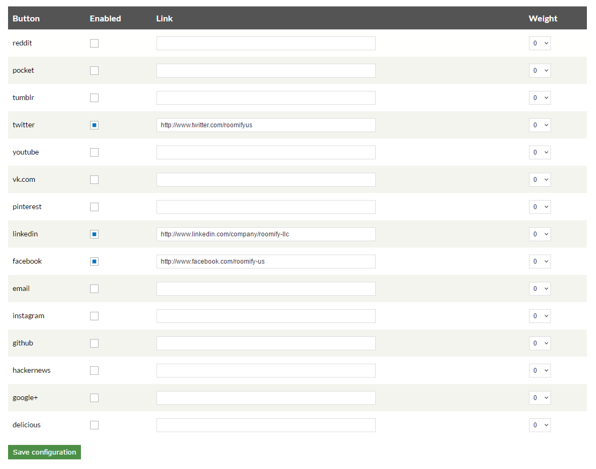

.. _roomify_accommodations_configure_social:

Configure Social Sharing Platforms
**********************************

There are two areas on the dashboard where social media links can be added. One is on your owner profile: :ref: `roomify_accommodations_welcome_profile`

The links under your owner profile will then be associated with whatever listings you are listed as owner of, and will appear below your name on your listing homepages. 

The other social sharing platform, the one located on your dashboard under the Manage Configuration > Configure Social Sharing Platforms tabs, is where social media accounts linked to your site as a whole can be inputted, not just accounts linked to a specific listing owner. 

Single-Listing Sites
=====================

If you are a single-listing site, it is up to you whether you input your social media accounts into both fields. Alternatively, you could link your personal accounts to your profile, and then your listing accounts under the **Configure Social Sharing Platforms** link. 

Multi-Listing Sites
====================

If you are a multi-listing site, then the individual owners will link their listing accounts to their profile and your overarching site accounts will be linked under the **Configure Social Sharing Platforms** tab.

