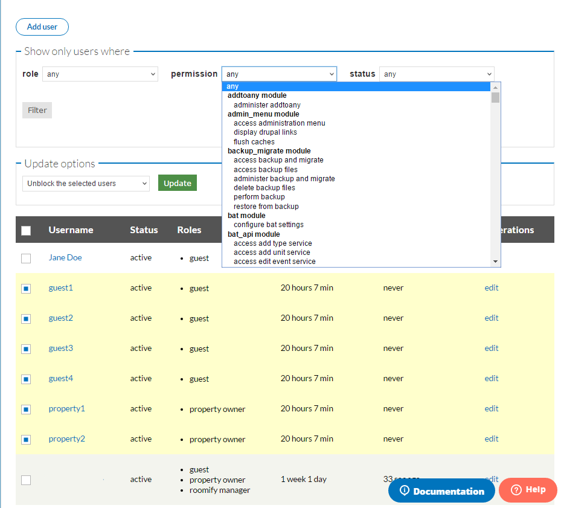
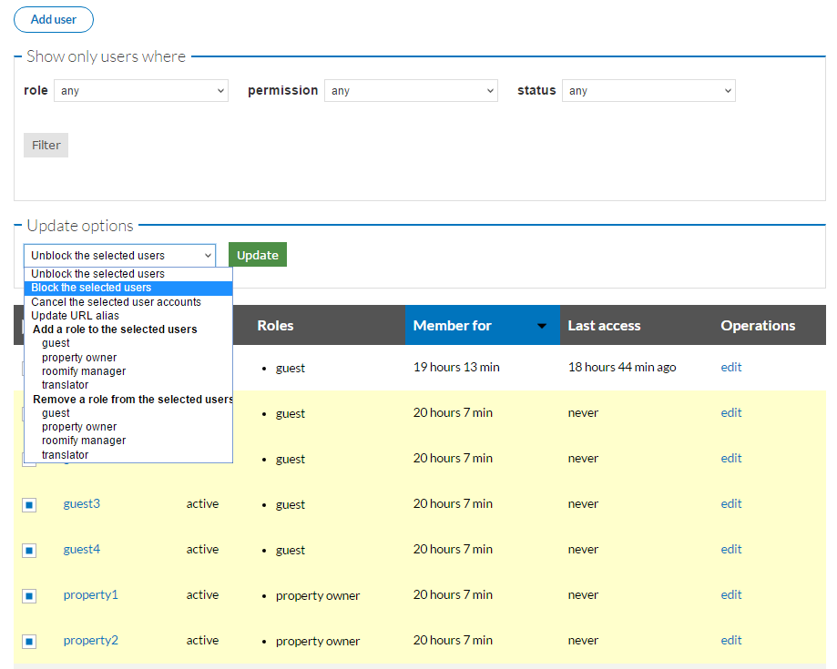

.. _roomify_accommodations_manage_users:

Manage Users
************

To manage the user profiles associated with your site, go to your dashboard, and under the Manage Configuration tab, select **Manage Users**. 

This screen lists all the profiles associated with your site, whether guests, property owners, or site managers.

The drop-downs at the top of the screen allow you to filter the users by any of the three categories: role, permission, and status.

Once the users you are wanting to work with are displayed below, you can check the specific user profiles you are wanting to modify. The drop-down titled **Update options** contains all the modification options.

Select the option you are wishing to apply, then click **Update**. The changes you have just made will be reflected in the list below.