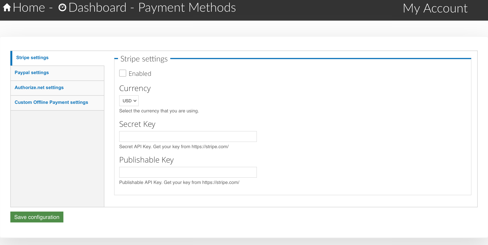
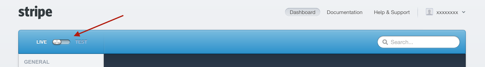
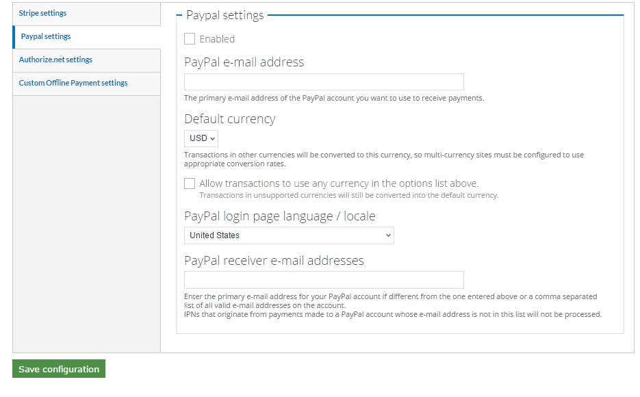
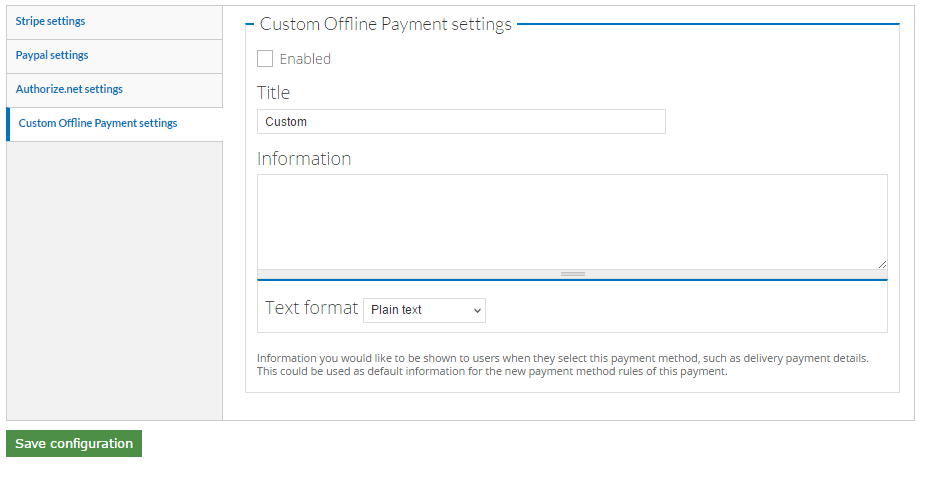

.. _roomify_accommodations_payment_methods:

Payment Methods
***************

Working on the Quickstart?  Get back to Step 4 here: :ref:`roomify_accommodations_setup_commerce`.

Roomify for Accommodations currently supports three payment gateways and offline payments. To configure your payment method, click on **Payment Methods** in the **Manage Configuration** tab of your dashboard.

There are four options:

#. `Stripe`_
#. `Paypal`_
#. `Authorize`_
#. `Custom Offline Payments`_

Stripe
======

To enable Stripe as your payment processor, first you will need a Stripe account.  If you do not already have one, you can sign up here:  https://dashboard.stripe.com/register.  Go through the registration process and then come back to your site. We will point you to everything you need to see in Stripe. Complete the setup using the following steps:

1. Check **Enabled** in the Stripe tab.
2. Select your currency - Current options are CAD - EUR - GBP - USD - AUD - CHF.
3. In Stripe, ensure that your account switch is set to **Live** (See screenshot below).
4. Enter your Secret Key from Stripe: https://support.stripe.com/questions/where-do-i-find-my-api-keys.
5. Enter your Publishable Key from Stripe: Ensure that both the Secret Key and the publishable key have no spaces before or after.
6. Click **Save configuration**.

Done!

Stripe also offers the ability to test payments on your site.  To set up your site to test payments, follow these steps:

1. Check **Enabled** in the Stripe tab.
2. Select your currency - Current options are CAD - EUR - GBP - USD - AUD - CHF.
4. Enter your TEST Secret Key from Stripe: https://support.stripe.com/questions/where-do-i-find-my-api-keys.
5. Enter your TEST Publishable Key from Stripe: Ensure that both the Secret Key and the publishable key have no spaces before or after.
6. Click **Save configuration**.

You can now make test bookings on your site without having to use a real card, or refund payments.  While using Stripe with the test keys, any billing address and expiration date will work with this number: 4111 1111 1111 1111

To view your test payments, log into your Stripe account and change the toggle in the top left corner from LIVE to TEST. Stripe can accept live or test payments from your site at any time. The keys you use control whether Stripe attempts to process a payment or not.

.. note:: If you use Stripe with the test keys, ensure that you switch to the live keys before you start taking bookings!

Paypal
======

To enable Paypal as your payment processor, first you will need a Paypal account.  If you do not already have one, you can sign up here:  https://www.paypal.com/home.  Go through the registration process and then come back to your site. 

 

We will point you to everything you need to see in Paypal. Complete the setup using the following steps:

1. Check **Enabled** in the Paypal tab.
2. Enter the email address associated with your Paypal account.
3. Select your currency - Current options are CAD - EUR - GBP - USD - AUD - CHF.
4. Check the **Allow transactions** box. 
5. Make sure you set the country from which your Paypal login originates.
6. Enter any additional email addresses that you wish to receive the Paypal email notifications.
7. Click **Save configuration**.

Authorize
=========

The first step to using Authorize.net as your payment method is setting up an account here: https://commerceguys.com/authorize-net-reseller. Once your account has been set up, access your download here: https://www.drupal.org/project/commerce_authnet and unzip the Commerce Authorize.Net module on your machine. 

Once you have Authorize.net downloaded, go to the **Configure Payment Methods** tab on the Manage Configuration tab of your dashboard and click on the **Authorize.net settings**:

1. To begin, click the **Enabled** check box on the Authorized.net tab.
2. Enter the API Login ID and Transaction Key obtained after you created your Authorize.net account.
3. During the initial setup process, check the **Test transactions in a live account** box. This will enable you to run tests before making live transactions. Once your account is ready to go live, check the **Live transactions in live account** box.
4. Two transaction types are available, one is **Authorization and capture** the other is **Authorization only**. The first option is the one you will likely desire to use. The second one would be used in instances where the card would not be charged until the product shipped, or similar circumstances where the charge was delayed after checkout.
5. The check boxes allow you to select which cards are supported with your merchant account. If no boxes are checked, any credit card type will be accepted.  
6. The final check box allows an automatic receipt email to be sent based on your account settings.
7. Don't forget to click **Save configuration** at the bottom of the page. 

Custom Offline Payments
=======================

When you enable custom offline payments, this means that no amount will be billed to the customer through your site. 

If you are desiring to go with the offline payment method, first check the **Enabled** box. This will make Offline Payment the default method. Enter the title and information into their respective fields and click **Save Configuration**. This method allows you to accept cash, checks, or other forms of offline payment. Keep in mind when using this method, however, that the full responsibility for collecting payment now resides with you. The customer will not be billed any amount during the booking process.

