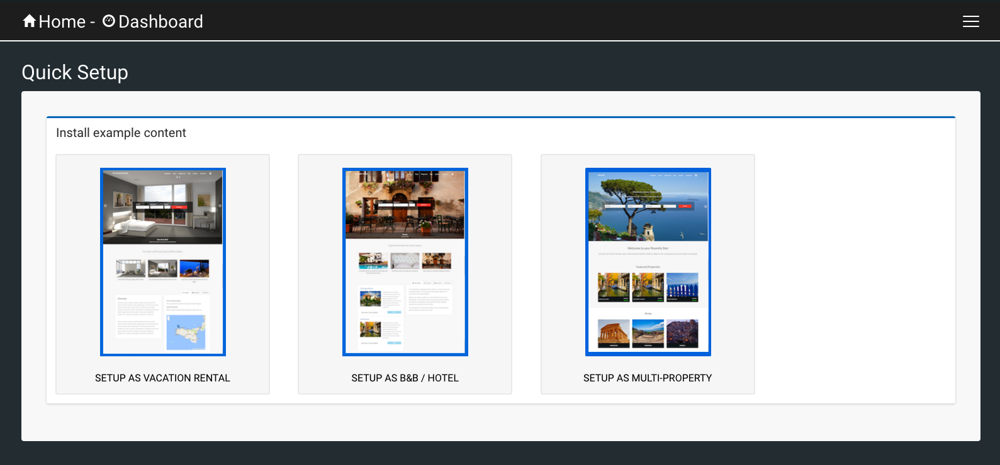

.. _roomify_accommodations_quicksetup:

Quick Setup
***********

Working on the Quickstart?  Get back to Step 2 here: :ref:`roomify_accommodations_setup_properties`.

Quick Setup allows you to quickly add and remove example content on your site.

There are three options:
	1. Casa: Vacation Rental
	2. Locanda: B&B/Hotel
	3. Multi-Property: Any combination of Casa and Locanda properties

If you created your site as a Casa, Locanda, or Multiproperty site, you will already have some example content to get you started. If you don't want the content, or you simply want to try out a different setup, nothing could be easier:

1. Click on **Delete <current setup type>**
2. Click on **Setup as <setup type you want to try>**

Done!

The Quick Setup is also a great way to get started with a single property site. The **Delete <current setup type>** button will ask you what content you want to delete, so you can keep what you need, and remove what you don't.
