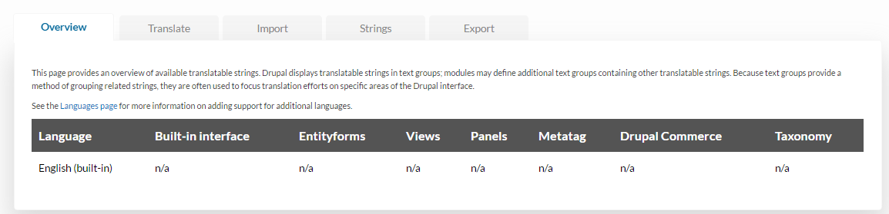
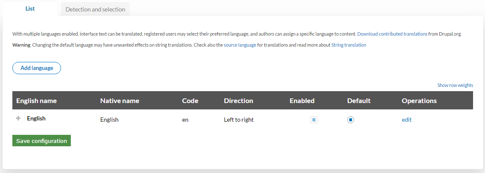
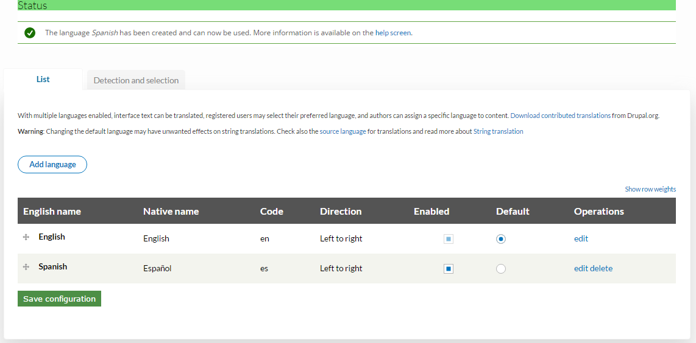
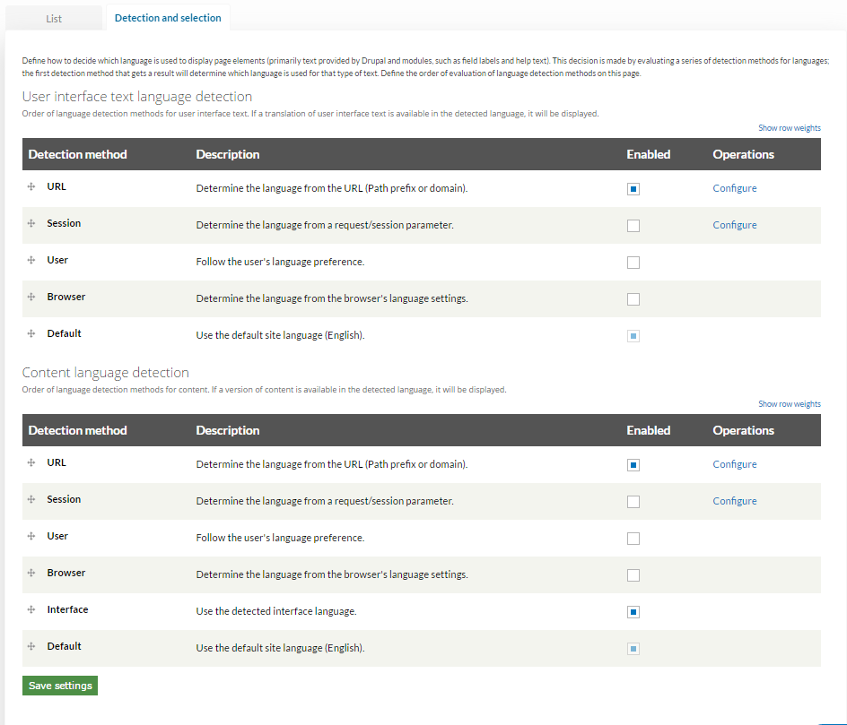
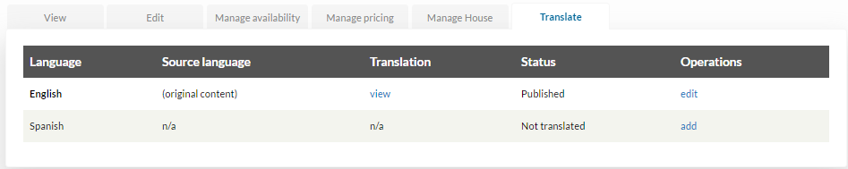
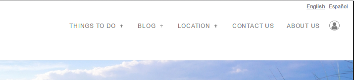
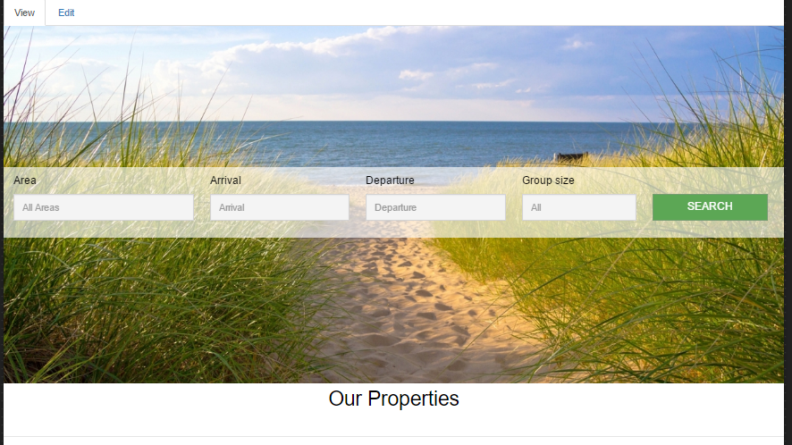
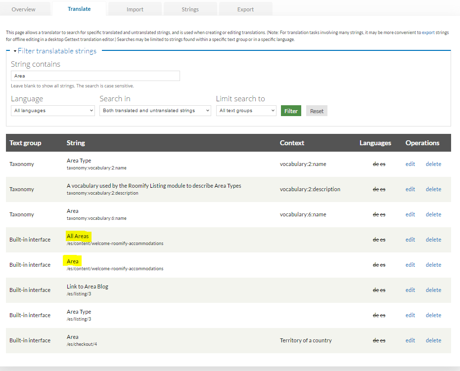
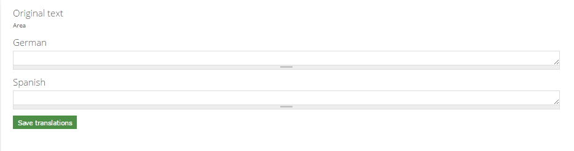

.. _roomify_accommodations_translations:

Translations
************

The first step in translating your Roomify for Accommodations site is to notify your site providers at: hello@roomify.us that you would like the translation module enabled. Once this option has been set up for your Roomify site, go to the Manage Configuration tab of your dashboard.

+ `Overview`_
+ `Translate`_

Overview
========

On the Overview tab, you will first need to add a language option to your site. Click on the **Languages page** link in the text.

Once on the language menu, click **Add language**.

Select the language that you are desiring to translate your page into from the drop-down and click **Add language**. Once you return to the Languages menu, you should see the language you selected on the list.

Next, click on the **Detection and selection** tab. (See image above). Ensure that the URL detection method is selected in both the User interface text language detection and the Content language detection sections, and the Interface box is selected in the Content language detection section, then click **Save settings**.

You are now set up to begin translating your pages. As an example, we will walk through setting up a property page with a Spanish version:

1. From your dashboard, select the piece of property whose page you want to translate and click **Edit**.
2. You should see the tab **Translate** listed on the far right, click on it to bring up the Translate menu.

3. You should see your newly added language listed as **Not translated**. Click on **add**. You will now be able to translate the content into your newly selected language. Once you have modified your content to reflect your new language, click **Save Property**. Once property has been saved, when you return to the Translate tab, it will say **Published** under the status of you new language. To translate any other properties under your Manage Listing(s) tab, simply select **Edit**, then go to the translate tab and click **edit** by the language of your choice. You essentially now have two versions of your webpage, the original one, and then the translated version. When viewed by the user, there should be a language choice in the corner of the header.

The steps above will allow you to translate the content of your listings and have it display properly. Another step in translating your page is translating the text strings that make up your menus, field names, etc. To do this, you will need to access the next tab on the Translate menu, accessed from the Manage Configuration tab of your dashboard.

Translate
=========

At first glance, this menu can be slightly overwhelming, however, as we walk through the steps involved in translating site text strings, it will become more manageable. To begin, identify the text you want to translate. For this example, we have chosen a field titled **Area**, featured on the homepage. 

1. To locate the text string associated with the field title you are desiring to translate, enter the key word into the **String contains** field and then click **Filter**.

2. This will pull up all instances where the key word is used. In our example, the correct **Area** can be identified by its file path, since we know it is on the Welcome Page and not in the Taxonomy menu. The other text highlighted is the default text that is listed in the **Area** field on the homepage.
3. Once the text you are desiring to translate has been identified, click **edit**. This will pull up the fields below.

4. In the appropriate fields, input the translation of the original text, then click **Save translation**.
5. Once this process is complete, your translation will appear when the alternate language is selected. In our example, **Area** now appears as **zona**.

Translating each piece of your website, one text string at a time, is a fairly involved process and will take some time. There are other methods of translation that use the remaining tabs of your Translate menu, however, these will require assistance from your Roomify provider and should not be attempted on your own. If you wish to learn more about importing translation modules, please contact your Roomify managers at: hello@roomify.us.
 