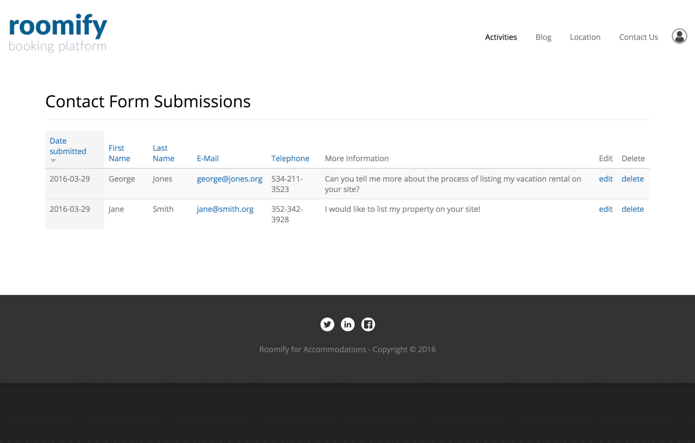

.. _roomify_accommodations_content_contact: Manage Contact Forms,

Manage Contact Form Submissions
*******************************

Your Roomify for Accommodations site includes a general contact form, accessible via the **Contact Us** link in the main menu.  To change the link name, or remove the link entirely, see: :ref:`roomify_accommodations_content_menu`.  Roomify Managers can view contact form submissions by doing the following: in the **Manage Content** tab of your dashboard, click on **Manage Contact Form Submissions**. Submissions can also be edited or deleted.

