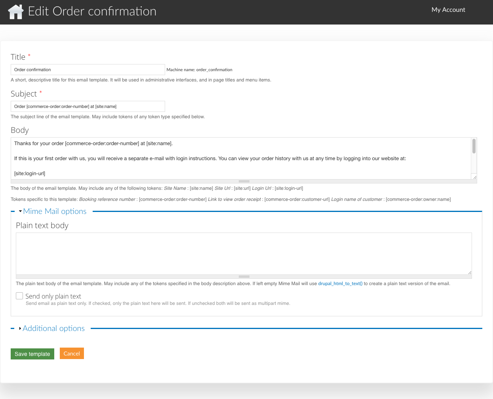

.. _roomify_accommodations_content_email:

Manage Email Templates
**********************

The text of the emails sent by your site can be customized by Roomify Managers.  In the **Manage Content** tab of your dashboard, click on **Manage Email Templates**.  Find the template you wish to update, and click **Edit**.

#. `Title`_
#. `Subject`_
#. `Body`_
#. `Additional Options`_

Title
=====

The title is only used within the site, on administrative pages.

Subject
=======

See: `Body`_

Body
====

You can use certain tokens in the Subject and the Body of your emails, that will be replaced with the information relevant to the action that triggered the email. The tokens available are listed beneath the Body field. There are a few tokens that are available to all emails - site name, site url, and the site login url.

An example of how a token works:

Your sites' url is "mysite.roomify.me".  You would like the subject line of the order confirmation email to read "Thank you for making a booking at mysite.roomify.me"

The Subject field in the template should be: Thank you for making a booking at [site:url]

Additional Options
==================

From Override:
	The **From Override** allows you to customize the email address that is used as the Sender email.  By default, all email templates will use the site e-mail address. If you would like a particular template to use something different, you can specify that here.

CC Default:
	If you would like to cc an email address or addresses when a system email is sent, enter them here.

BCC Default:
	As with the cc default, If you would like to bcc an email address or addresses when a system email is sent, enter them here.

Recipient callback:
	Coming Soon!

Be sure you click **Save**!
