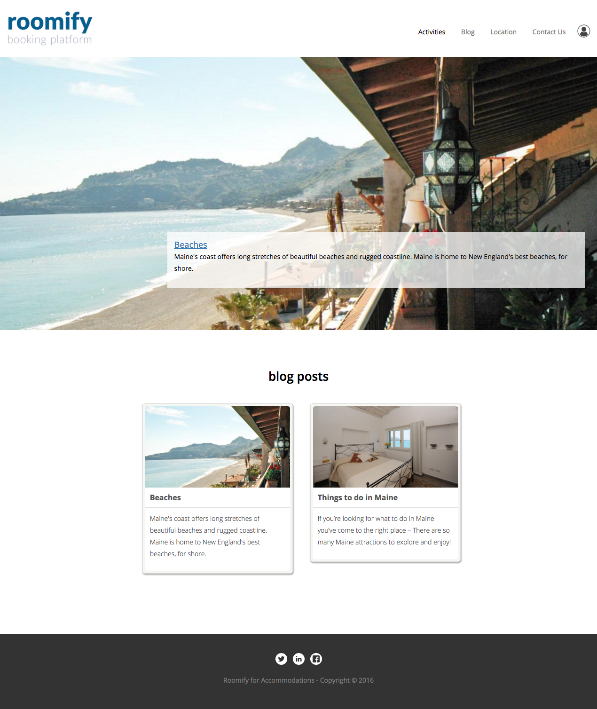
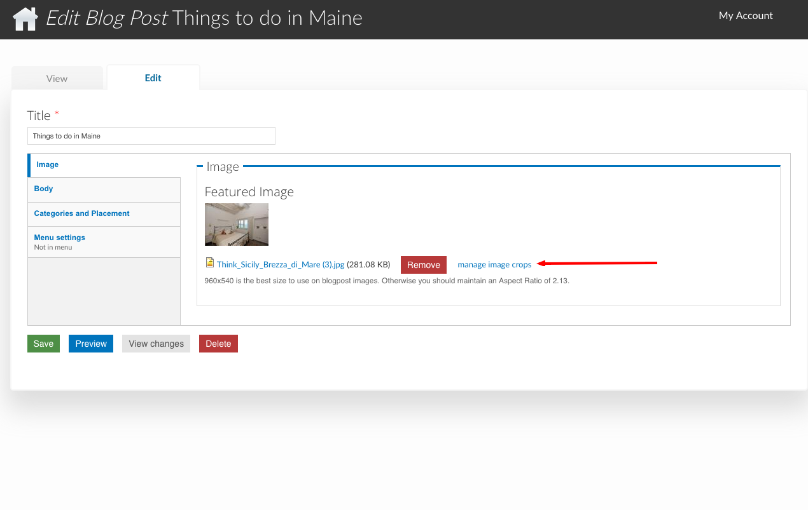
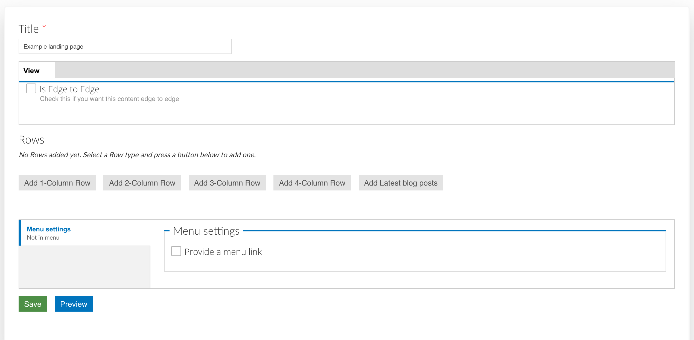
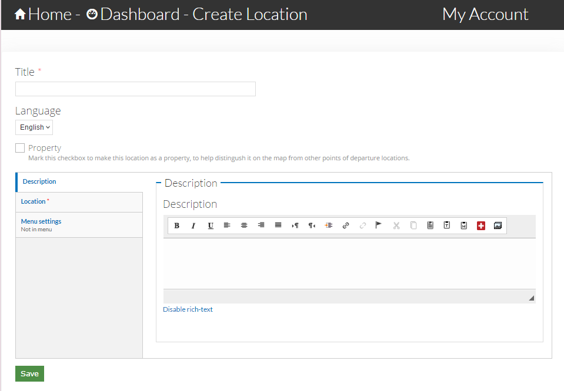
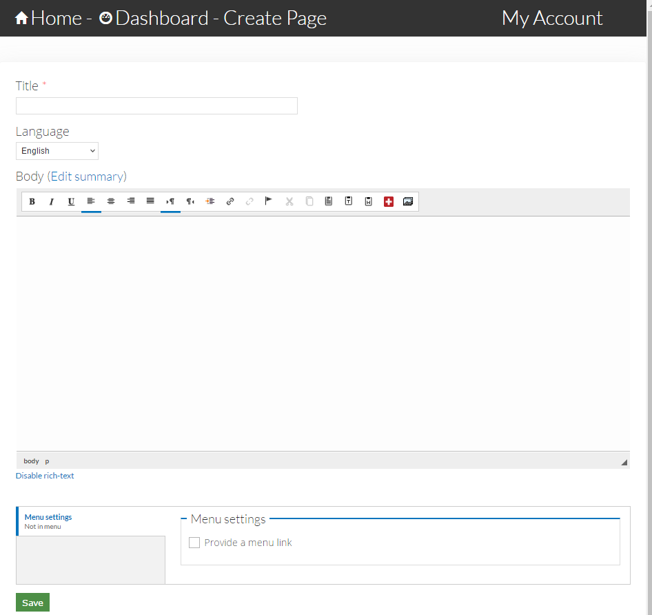
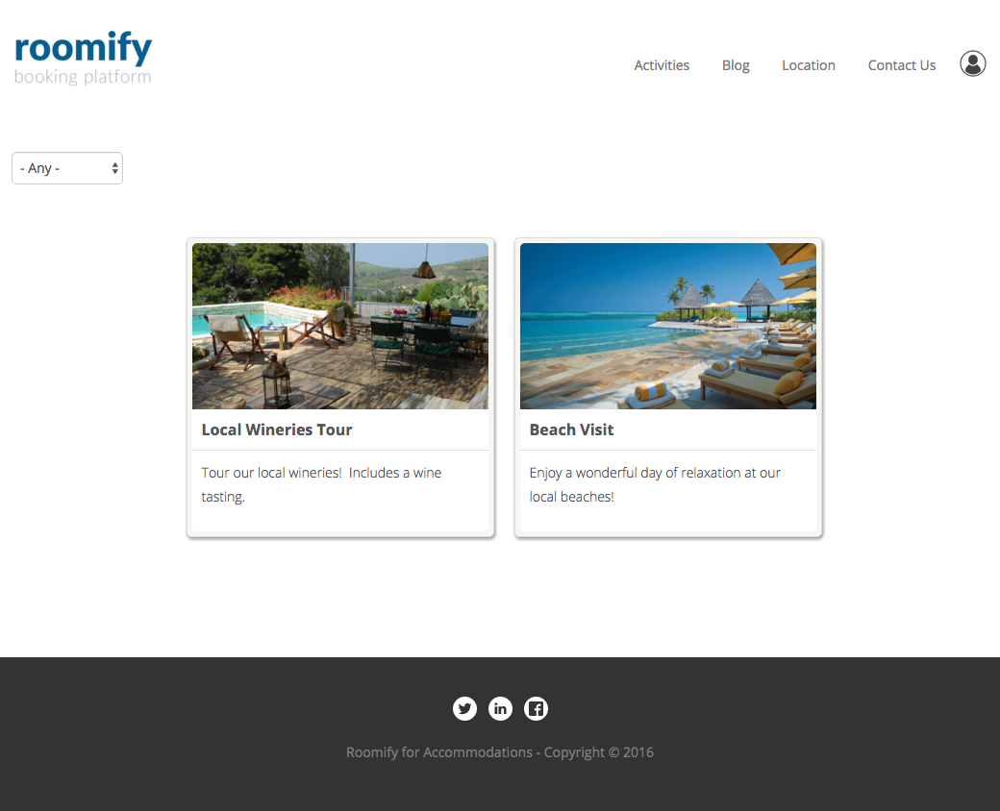
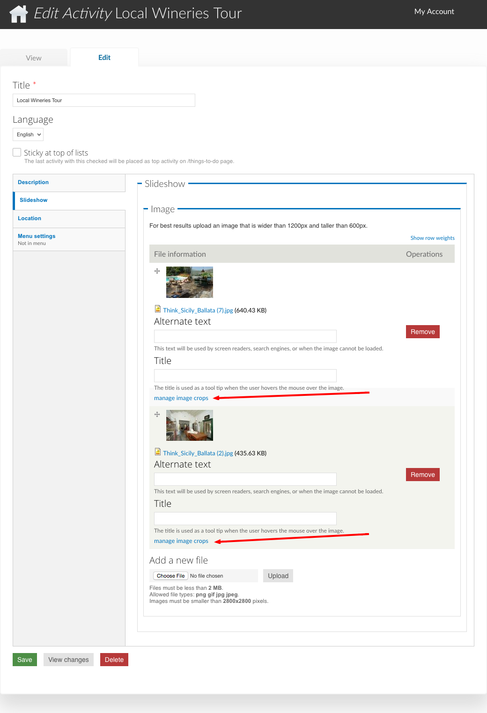
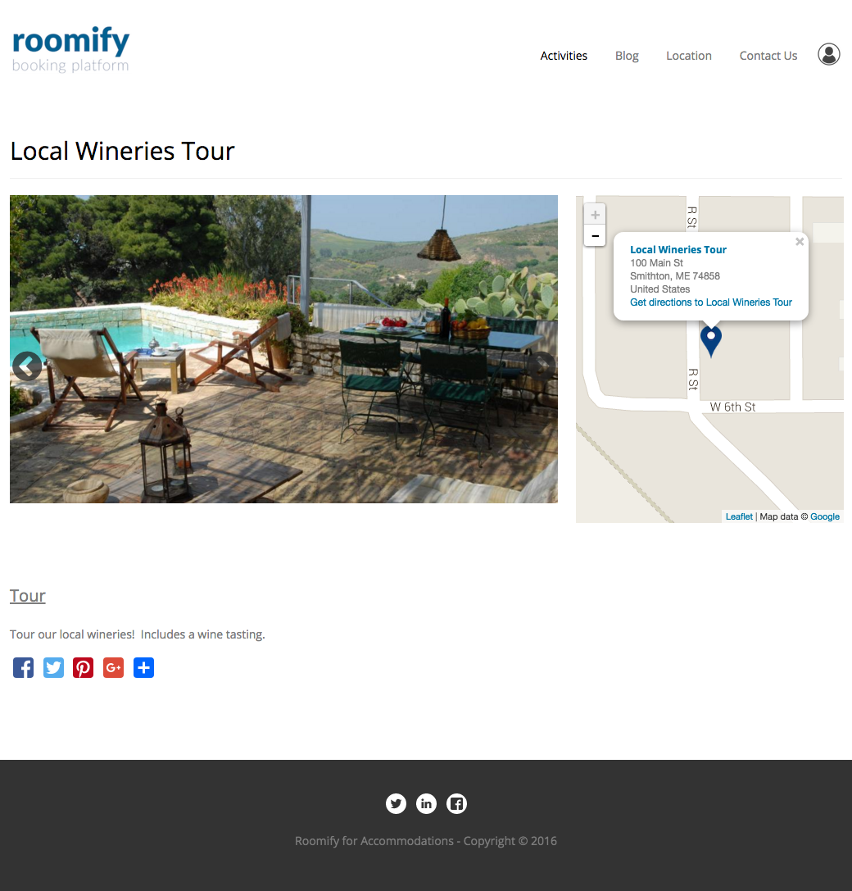

.. _roomify_accommodations_content_new:

Create New Content
******************

Your Roomify site is built on top of a powerful CMS called Drupal.  This means that in addition to being able to list properties and take bookings, you also have the ability to create an extensive blog, add local attractions (activities), create Locations, and create Landing Pages to feature components of your site. To add new content, open the **Manage Content** tab of your dashboard, click on **Add new content**, and select one of the following types of content to add:

#. `Blog Post`_
#. `Landing Page`_
#. `Location`_
#. `Page`_
#. `Things to do`_

Blog Post
=========

The **Blog** link in the main menu leads to a view of all of your blog posts.  They are displayed by most recent to oldest, but you can use the **sticky at top of lists** (See **Categories and Placement**) control to keep a post or posts at the top of the results.

+ `Image Tab`_
+ `Body Tab`_
+ `Categories and Placement Tab`_
+ `Menu Settings`_

Image Tab
+++++++++

The blog image is displayed on the main Blog view, and on the individual blog post.  Be sure you crop the image!

Body Tab
++++++++

Write your blog post here!

Categories and Placement Tab
++++++++++++++++++++++++++++

*Tags*
	Add tags by clicking in the field and selecting a tag. You can select additional tags by clicking again, next to the previously selected item.  If the tag you are looking for is not in the list, type the name (such as **Orange**). A box will appear with the text: "The term **Orange** will be added", click on the box to create the tag and add it to your blog post.

*Sticky at top of lists*
	This setting will keep a post or posts at the top of the results, above newer posts, and will cause the post to appear in the **Featured Posts** view in the sidebar of your blog posts.

*Featured Blog Post*
	This setting will make the blog post featured at the top of the blog page.  Only one post can be featured at a time, so be sure to unfeature the old post when you are featuring a new one, or you will not see any changes!

Menu Settings
+++++++++++++

To add a blog post to your site menu, click on **Provide a menu link**.  Edit the Menu link title, if you wish to, and select <main menu> as the parent item.  Multi-level menus are not supported, but this feature is in the works!

Landing Page
============

Landing pages are an extremely flexible way to highlight content on your site. They allow you to populate a single webpage (most commonly a homepage) with a wide selection of your content and with certain widgets. Because they are so flexible, they can be a bit daunting at first glance, so we will step through an example. Begin by creating a new landing page: Dashboard > Manage Content > Add new content > Landing Page

Give your landing page a title to identify its application. The **Is edge to edge** option determines whether the content is padded on the sides or not.  Experiment with this to see which way you like it better!

Now we will add some content to our page.  You will have the option to add a 1, 2, 3, or 4 column Row, or the **Latest Blog Posts** widget. A row is a horizontal section of the page.  The number of columns in the row determines how many elements can be added to the row. The number of rows you add will depend on how many elements you want to include on your Landing page. You will see examples of this as we add content to our page.

In this example, we will feature two properties on our site. One called "Locanda Vivaldi," and one called "Casa Azzurra." Because we will have two properties, we will select a 2-column row and one property will go in each column:
 
1. Click on **Add 2-Column Row**
2. Click on **Edit 2-Column Row**
3. Row Title - If you want this row to have a title, add one, otherwise you can leave it blank. For our example, this row is titled **Featured Properties**
4. Row View - Again, you can decide if you want the content to be edge to edge.  If you are using a background, you will probably want edge to edge.
5. Row Background - You can select a color, or add an image.  For this row, the background has been left blank.
6. First Element - Each column will contain an element. To feature a property, select **Property** from the drop down list, and click **Add new element**
7. Start typing the name of the property you wish to feature, and select it from the autocomplete - the first property in our example is "Casa Azzurra"
8. Second Element - click on the **second element** tab, and repeat the steps - select **Property**, click **Add new element**, and type in the name of the second property you wish to feature (in this case, 'Locanda Vivaldi')
9. The last setting to pay attention to is whether or not you want to link your new landing page to the menu. You will also be able to select where on the menu your page will appear.
10. Click **Save and Close** - the modal window will close
11. IMPORTANT! - Click on the green **Save** button at the bottom of the page, you should now see your new landing page, with two featured properties!

Because the purpose of landing pages is to give you the ability to customize as much as desired, there are many different types of content that can be added to the columns in each row you choose to add. In the example above, you now have a row with two properties on display. If you want further elements, you can add another row and select a different element type. We encourage experimenting with the landing pages until you find a combination of elements that suits your needs.

Location
========

Adding a location to your site is an easy process and will allow you to highlight some of the points of interest in a specific area, mark the closest points of departure .

You will also notice in the above image, the check-box **Property**. Adding your property locations to the map will allow guests to see which activities are close to each of your properties. To add a location, use the following steps:

1. Add the title of the location.
2. If the location you are adding is one of the site properties, check the **Property** box.
3. Fill out the description field to identify the location.
4. In the second tab, add the location point to the map. This can be done by either inputting the address and selecting **Get location** or manually locating the point on the map.
5. The last tab allows you to provide a link from the main menu directly to your location. For most locations, no menu link will be necessary. Your location will still show up on the **Locations** map. Choosing to add a link from the menu could be used when the location you added is very well known and deserves extra attention.
6. Don't forget to save!

Page
====

Basic pages allow you to add static content that can then be displayed on your site menu. A great example would be an **About Us** page. To add a basic page, go to **Add new content** under the Manage Content tab of your dashboard. From this menu, select **Page**. This will take you to the content form.

Add the title of your page, then fill out the body field with your content. At the bottom of the window you can enable the menu link. This will give your users access to this page from your site's main menu. Remember to save your page!

Things to do
============

Create activities to describe to guests what they can do in and around your property. Activities can also show up on the map if you give them an address and co-ordinates. This is a great way to help guests imagine how great a stay at your property could be.

All of your activities will be displayed on a page that is accessed by the **Activities** link in your menu.  If you will not be using this feature, and wish to disable the link, do this by updating the menu (:ref:`roomify_accommodations_content_menu`).  Activities can be filtered by type, and clicked on to view more information.

Adding Activities
+++++++++++++++++

+ `Sticky at top of lists`_
+ `Description Tab`_
+ `Slideshow Tab`_
+ `Location Tab`_
+ `Menu Settings Tab`_

Sticky at top of lists
______________________

Checking this box when creating an activity will keep it at the top of the /activities page, regardless of how many activities you add to your site.

Description Tab
_______________

*Activity Type*
	This describes the type of activity you are creating. Types can be added by clicking in the field and selecting a type. You can select additional types by clicking again, next to the previously selected item.  If the type you are looking for is not in the list, type the name (such as "Day at the Beach"). A box will appear with the text: "The term **Day at the Beach** will be added," click on the box to create the type and add it to your activity.

*Body*
	Use this field to describe your activity!

Slideshow Tab
_____________

Add an image or images to your activity.  The first image will be used on the /activities page, and all others will be shown in the slideshow on the activity itself. Ensure that you crop your images, or you may see unexpected results!  The link to crop an image is found here:

Location Tab
____________

You can display a map on the activity by setting the location. The address is optional.  If you fill this in, it will be shown in a tooltip when the marker is clicked on.  To set the marker location, use the Map Coordinates.  The coordinates can be set in two ways:

#. Enter an address in the **Geocode Address** field.  Click on **Find marker** (under the map). Once the marker position has been moved, click on **Place marker here** and confirm.
#. Drag the marker to the correct location on the map. Click on **Find marker** (under the map). Once the marker position has been moved, click on **Place marker here** and confirm.

Here is an example of an activity with the geo location set and an address filled out.

Menu Settings Tab
_________________

To add an activity to your site menu, click on **Provide a menu link**.  Edit the Menu link title, if you wish to, and select the parent item. 