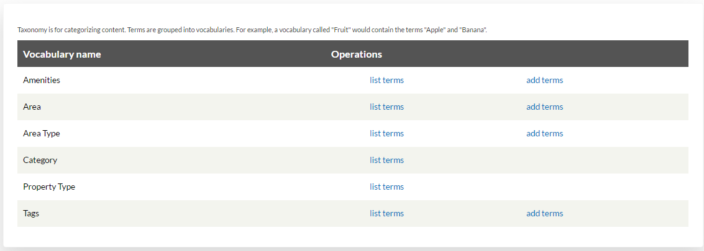
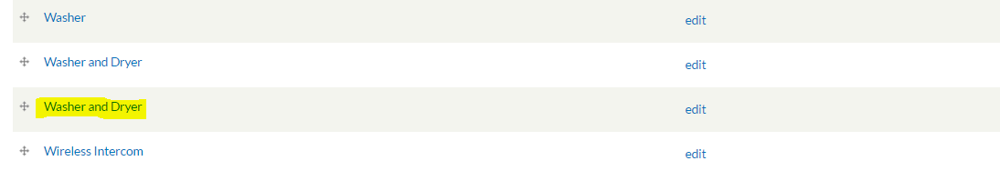

.. _roomify_accommodations_content_taxonomy:

Manage Taxonomy
***************

The Manage Taxonomy button takes you to a menu that allows you to manage all the terms that have been inputted into your site, in each category. 

This can be useful if you want to add new terms into the system, or if you want to change or delete terms that have already been inputted. When you are entering terms during other parts of site setup (adding amenities, areas, blog tags, etc.) they will automatically be added to the Taxonomy, allowing you to keep up with what has been entered, or what terms might be missing. 

In the example below, two of the same entry exist. To fix this, simply select **edit** and use the delete button at the bottom of the screen.

