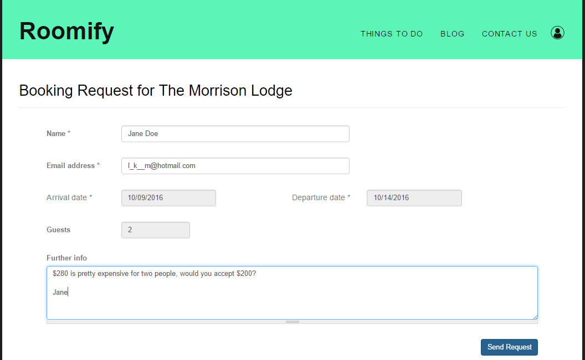
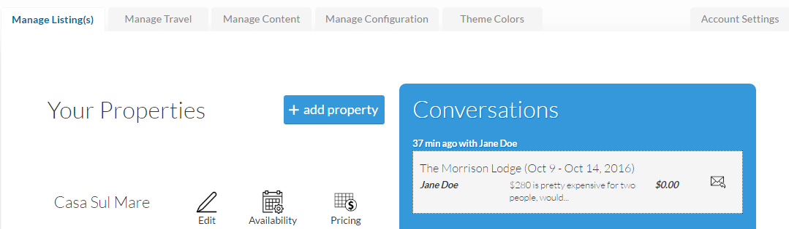

.. _roomify_accommodations_listings_enquiries:

Enquiries
*********

A user enquiry is generated when the **Request to book** field it utilized on your listing's homepage.

Once the user submits their enquiry, it will appear on your dashboard under the Manage Listing(s) tab.

From there you simply click on the conversation you wish to answer. From the conversation screen, you can respond to the enquiry with a message and/or a booking offer. 