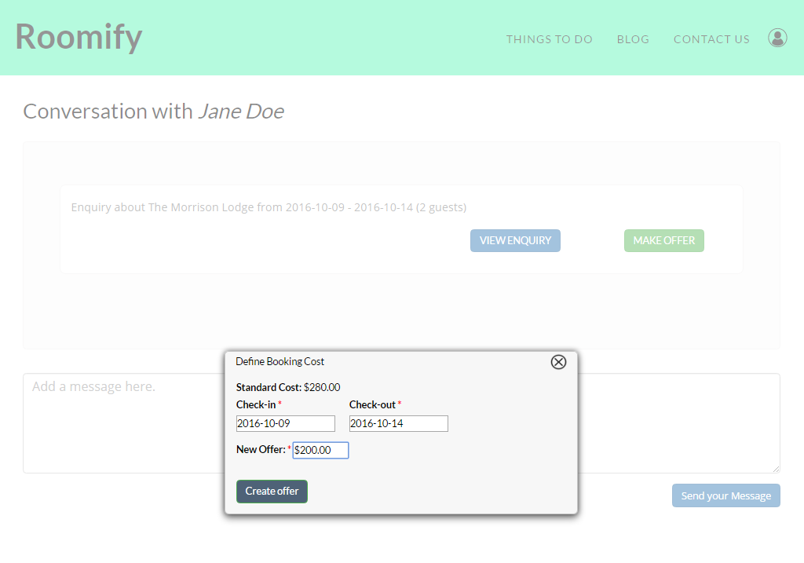

.. _roomify_accommodations_properties_bookings:

Bookings
********

Bookings are made in one of three ways:

1. A user requests to book, and you have allowed instant bookings. With instant bookings enabled, users can confirm booking and proceed to checkout. Once the checkout process is complete, the booking will show up on the property's calendar. You will also receive email notifications.

2. A user makes an enquiry, either because instant bookings are not enabled, or because they need additional information prior to booking.

This enquiry will appear on your dashboard. You will then be able to respond to the enquiry with a message or a counter offer if appropriate.

The user will then accept your offer, and the booking will automatically appear in the property's calendar.

3. The final way bookings can be made is manually. If you access the Availability menu, listed under the property you are wishing to book, in the Manage Listing(s) tab (see image above), you can manually select the dates and when the pop-up window appears, choose **Create booking**.

This allows you to work with customers over the phone if necessary. This view will also allow you to manually change bookings that have already been made.
 

