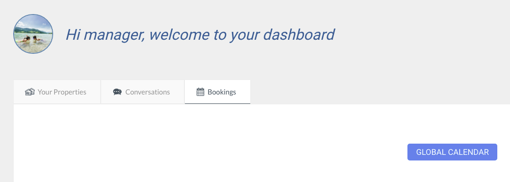
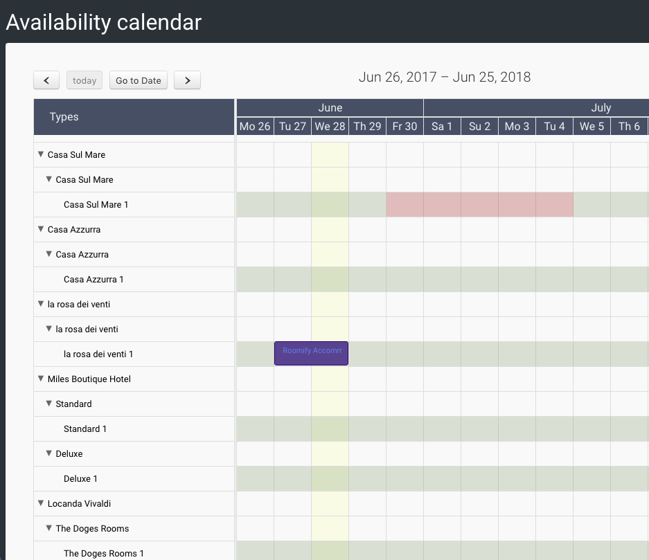

.. _roomify_accommodations_global_calendar:

Global Calendar
***************

It’s a new feature that allow a property owner or a manager to have a global overview about the status of bookings and unavailabilities in a single calendar. 
You can find that link clicking “Global Calendar” on the sidebar menu, under Bookings.

So if you have many properties, and many unit for a type, you will have as many rows as properties and unit.

You may also change the availability clicking directly from the calendar.
