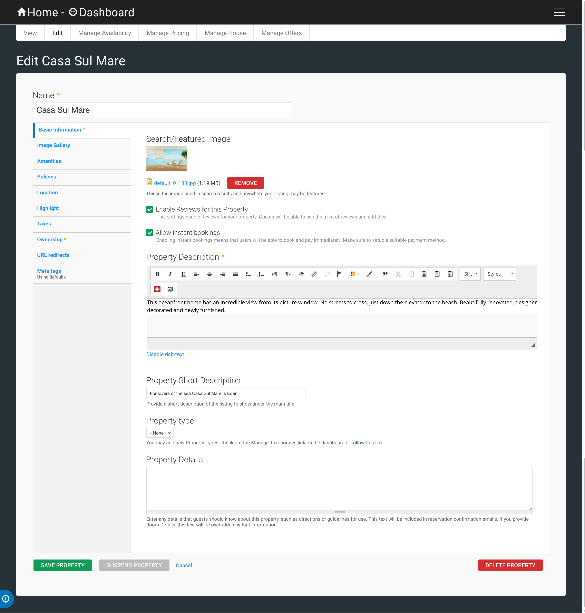
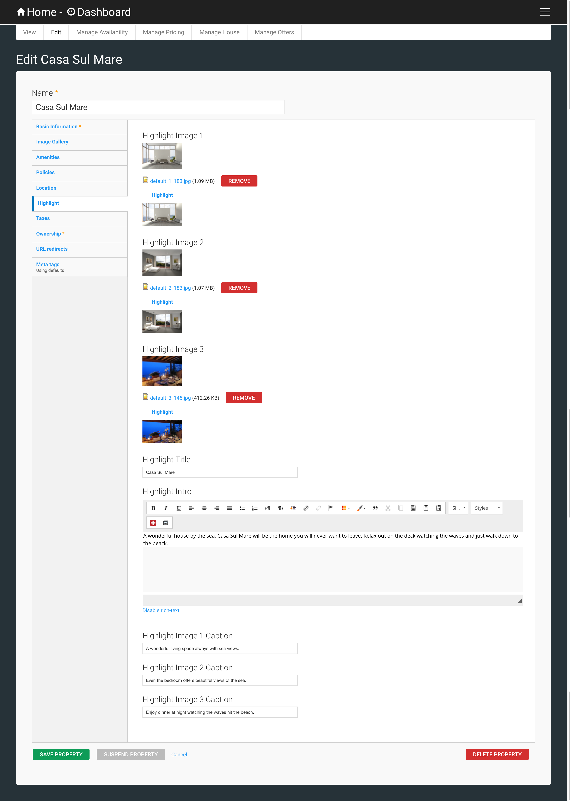
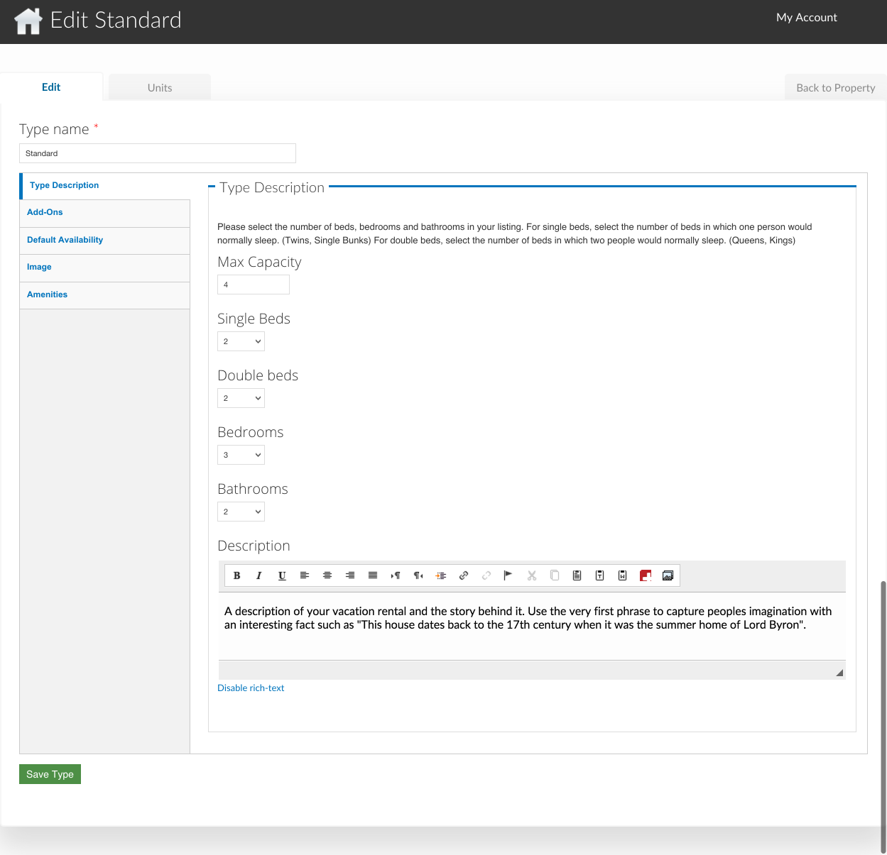
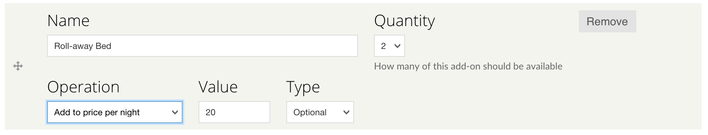
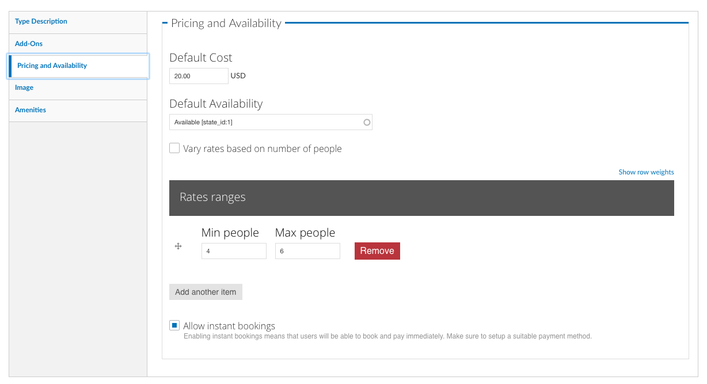

.. _roomify_accommodation_properties_properties:

**********
Properties
**********

Your dashboard Properties view provides a central place to manage property or properties.  Use this view to:

#. `Create a Property`_
    a. `Single Unit Property`_
    b. `Multi Unit Property`_
#. `Manage Properties`_
    a. `View`_
    b. `Edit`_
    c. `Manage Availability`_
    d. `Manage Pricing`_
    e. `Manage Rooms`_ or `Manage House`_

Create a Property
=================

Creating a property is done from within your dashboard.  If you have permission to add a property, you will see the 'add property' button, as shown in the screenshot below.

.. image:: images/add_property.png
   :width: 700 px
   :align: center

Click on 'add property'. You will be asked for the name of the Property, and asked to select the type of property:

.. image:: images/name_property.png
   :width: 700 px
   :align: center

+ `Single Unit Property`_

   A single unit property is a property that can only be booked as a whole. The most common type of single unit property is a Vacation Rental.  The rental property may have 1, 2, or even 12 bedrooms, but a booking is made for the whole property.

+ `Multi Unit Property`_

   A multi unit property is a property with multiple individually bookable rooms. Both B & B's and Hotels are multi unit properties.

Single Unit Property
--------------------
To create a single unit property, enter the name of the property, select 'Single Unit (Entire Home)', and click 'next'. You will then be asked to define the maximum number of occupants, and the default nightly rate:

.. image:: images/single_unit_1.png
   :width: 700 px
   :align: center

Click on 'Create property and add details' - this will create your property and direct you to the property management interface: `Manage Properties`_

Multi Unit Property
-------------------

To create a multi unit property, enter the name of the property, select 'Multi-Unit (multiple rooms / types within a property)', and click 'next'.

.. image:: images/multi_unit_1.png
   :width: 700 px
   :align: center

You will be asked to enter the type name, number of rooms, default price per night, and max occupancy, for each of your room types.  If you have a B&B, it will look something like this:

.. image:: images/multi_bnb.png
   :width: 700 px
   :align: center

A hotel might look more like this:

.. image:: images/multi_hotel.png
   :width: 700 px
   :align: center

When you have finished adding your room types (don't worry, you can always add more later), click on 'Create property and add details' - this will create your property and direct you to the property management interface: `Manage Properties`_

Manage Properties
=================

Every property has five tabs:

1. `View`_
2. `Edit`_
3. `Manage Availability`_
4. `Manage Pricing`_
5. `Manage Rooms`_ or `Manage House`_

View
----

Click on this tab to see how your property is displayed on the site.

Edit
----

A Property has several categories of information associated with it:

1. `Basic Information`_
2. `Image Gallery`_
3. `Policies`_
4. `Amenities...`_
5. `Location`_
6. `Highlight`_

Basic Information
~~~~~~~~~~~~~~~~~

*Owner*
   The owner field controls determines whether or not the Name and Image on the Property Owner Profile appear on your property listing. To display this information, enter your user id in the field.

.. Add link to docs for creating owner profile

*Property Description*
   The property description is displayed in the 'Overview' tab at the bottom of your property page.

*Property Short Description*
   The property short description is shown below the Image Gallery at the top of your property page.

*Search/Featured Image*
   This image is used in search results, and anywhere your property is featured on the site.  It will *not* appear in the image gallery.  After uploading an image, click on 'manage image crops' (next to the 'Remove' button), and select a crop area for each image style.

*Property type*
    Some Roomify for Accommodations site may have property categories, if so, you may select the property type that best describes your property.

*Allow instant bookings*
    If the site on which your property is listed allows instant bookings, this switch will allow you to turn off instant bookings for your individual property, and only take bookings via Enquiries.  This setting will be overridden by the 'Allow instant bookings' setting on the House or Room, and will have no effect at all if instant bookings have been disabled site-wide.

Image Gallery
~~~~~~~~~~~~~~~

.. image:: images/image_gallery.png
   :width: 700 px
   :align: center

Each image in your gallery can have an optional title and caption, both will overlay the bottom portion of the image.

*Title*
   This is the title of the image.

*Alternate text*
   This is the image description.  It be displayed underneath the image title, as well as being used by screen readers, and anywhere the image cannot be displayed.

To add an additional image, simply click on 'Choose File' in the 'Add a new file' section, select a file from your computer, and click 'Upload'.

Policies
~~~~~~~~

.. image:: images/policies.png
   :width: 700 px
   :align: center

Any information about policies or rules should be specified here.  This will be displayed in the tab 'Policies', at the bottom of your property page.  If this field is left empty, the tab will not be displayed.

Amenities...
~~~~~~~~~~~~

.. image:: images/amenities.png
   :width: 700 px
   :align: center

Property amenities describe amenities available to a single unit property, or amenities that are available to all rooms of a multi unit property (such as a pool). These can be added by clicking in the field and selecting an amenity. You can select additional amenities by clicking again, next to the previously selected item.  If the amenity you are looking for is not in the list, type the name (such as 'High Speed Internet'). A box will appear with the text: 'The term 'High Speed Internet' will be added', click on the box to create the amenity and add it to your property.

Location
~~~~~~~~

.. image:: images/location.png
   :width: 700 px
   :align: center

*Area*
   The area is used in searches to narrow down a list of properties by area. Areas can be added by clicking in the field and selecting an area. You can select additional areas by clicking again, next to the previously selected item.  If the area you are looking for is not in the list, type the name (such as 'New York City'). A box will appear with the text: 'The term 'New York City' will be added', click on the box to create the area and add it to your property.

*Area Type*
   The area type is another way of categorizing a property, and is generally used on large sites with many different properties. An example of an area type is 'Beachfront'. Area types can be added by clicking in the field and selecting an area type. You can select additional area types by clicking again, next to the previously selected item.  If the area type you are looking for is not in the list, type the name (such as 'Lakefront'). A box will appear with the text: 'The term 'Lakefront' will be added', click on the box to create the area type and add it to your property.

.. *Location*

Highlight
~~~~~~~~~

Highlights are used to showcase features of your property.  This could be rooms in your vacation rental or B & B, or special features of your Hotel, such as a swimming pool.

.. *Highlight Intro*

Manage Availability
-------------------

To manage the availability of your property, click on the 'Manage Availability' tab.  This page will look much the same for a single unit property and a multi unit property, but both are managed the same way.

A single unit property has only one unit to manage.

.. image:: images/locanda_avail.png
   :width: 700 px
   :align: center

Multi unit properties show all units in the same place.

The default status of a unit is indicated by the background color. A light red indicates the unit is unavailable by default, whereas a light green background indicates the the unit is available.  To change the default availability for a type and its unit(s), see `Default Availability`_.

To override the default availability, select a date or range of dates for the unit. (To select a range of dates click and drag the dates you wish to update.) You will be given three choices: Make Available, Make Unavailable, and Create Booking.

Manage Pricing
--------------

Manage Rooms
------------

A Property will either have a House (single unit property) or multiple Rooms (multi-unit property) associated with it.  To manage the Rooms of your multi unit property, click on the 'Manage Rooms' tab.

In this tab, you can:
   Add additional types (using the same interface with which you added a property), by clicking on the 'add type' button.

   Edit an existing type, by clicking on the 'Edit' link for the type you wish to update. `Edit Room/House`_

   Edit the name of the Unit(s) of a type, by clicking on the 'Units' link for the type you wish to update, and then again on 'Edit Unit'. Update the name, and click 'Save Unit'.  The 'Edit' tab will take you to the editing interface for the Room type that unit belongs to, or you can click on the 'Back to Property' tab to return to your property.

Manage House
------------

A Property will either have a House (single unit property) or multiple Rooms (multi-unit property) associated with it.  To manage the House of your single unit property, click on the 'House' tab.

Next, click on 'edit', next to your house name. (Should generally be the same as the name of your property, but this is not required).

.. image:: images/house_edit.png
   :width: 700 px
   :align: center

Edit Room/House
~~~~~~~~~~~~~~~

1. `Type Description`_
2. `Add-Ons`_
3. `Default Availability`_
4. `Image`_
5. `Amenities`_

Type Description
~~~~~~~~~~~~~~~~

This tab contains the basic information about the house or room type.  Specify the maximum number of people that can be accommodated, the number of single beds (twin/bunks), the number of double beds (full/queen/king), number of bedrooms, and number of bathrooms.

The Description field allows you to describe this room type, and will be displayed in a tooltip on the property page.

NB: *The description field is used for Multi Unit Properties only*

Add-Ons
~~~~~~~

.. image:: images/type_addons.png
   :width: 700 px
   :align: center

Property Add-Ons allow guests to tailor their experience at your property, and may be configured to raise, lower or replace the price, per stay or per night. They are highly flexible, and there is no limit to the number of add-ons you may offer your guests. If made mandatory, they will be automatically added to a booking, and required for check out - this is useful for configuring per-stay charges such as a cleaning fee.

To charge a mandatory cleaning fee of $35 per stay, we would add an add-on configured as follows:

Name: Cleaning fee

Quantity: 1

Operation: 'Add to price' will add the fee per stay, as opposed to per night.

Value: $35

Type: Mandatory

.. image:: images/cleaning_fee.png
   :width: 700 px
   :align: center

To offer roll-away beds for $20 per night, click the 'Add another item' button and configure the new add-on as follows:

Name: Roll-away bed

Quantity: 2 (This will allow guests to request up to 2 beds)

Operation: 'Add to price per night'

Value: $20

Type: Optional

To allow guests to request a crib which costs $50 per stay, but may or may not be available, click the 'Add another item' button and configure the new add-on as follows:

Name: Crib

Quantity: 1

Operation: 'Add to price'

Value: $50

Type: On Request - the add-on's price will be displayed, but not added to the total. You will be responsible for collecting the additional fee at check-in if the add-on is available.

Default Availability
~~~~~~~~~~~~~~~~~~~~

The default availability field allows you to quickly make all units of a room type not available, by changing the field value to 'Not Available'.  Conversely, if you have made a type not available, and want to change it back to available again, change the field value to 'Available'.  You will see these changes reflected in the 'Manage Availability' tab of your property.

Image
~~~~~

*Multi Unit Properties only*

This image is displayed on the property.  Choose a good one!

Amenities
~~~~~~~~~

.. image:: images/type_amenities.png
   :width: 700 px
   :align: center

Room amenities are amenities that are specific to a certain room or room type. These are not used for single unit properties, and should be left blank. Add room amenities by clicking in the field and selecting an amenity. You can select additional amenities by clicking again, next to the previously selected item.  If the amenity you are looking for is not in the list, type the name (such as 'High Speed Internet'). A box will appear with the text: 'The term 'High Speed Internet' will be added', click on the box to create the amenity and add it to your property.

