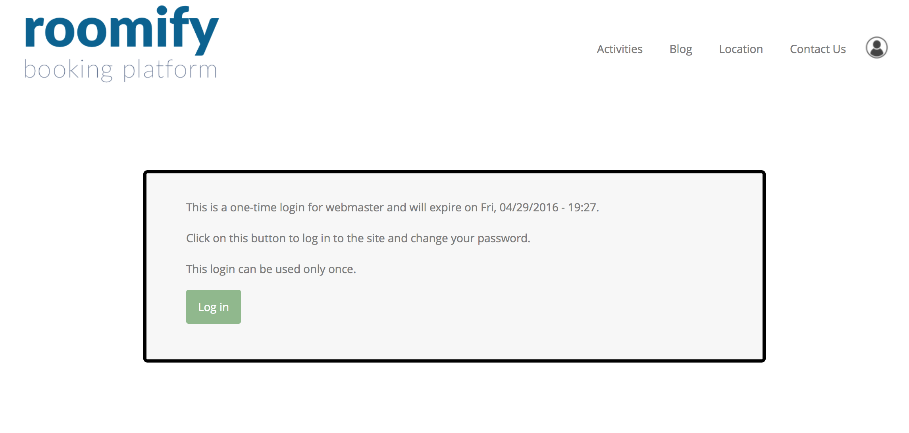
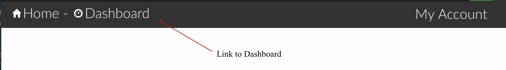

.. _roomify_accommodations_login:

Login
******

Your welcome email (separate from the order confirmation email) will have a link in it that will allow you to log into your site and set your password.  The link will look something like this:
	https://YOUR-SITE-NAME.roomify.me/user/reset/3/1461871638/m91_O5hAw8BvMjB4edRHL_3YDAM_gaBn

Click on the link!  You will be taken to your new site and logged in.  You should see this:

Click on **Log in**.  You will be taken to your user account, where you must enter a new password.  Choose something secure!  (Hint: **password** is not a secure password...)

Click **Save**

You're now ready to set up your site! Click on the **Dashboard** in the header, and ensure that you are in the **Manage Listings** tab.

