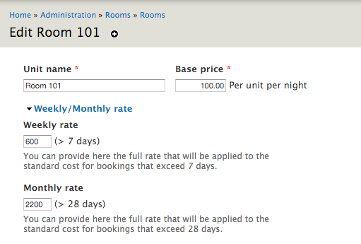
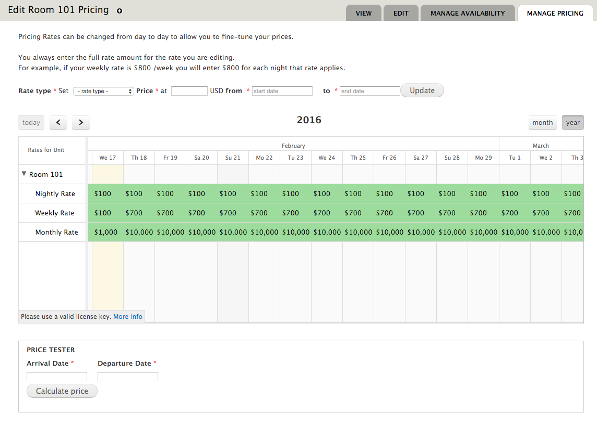
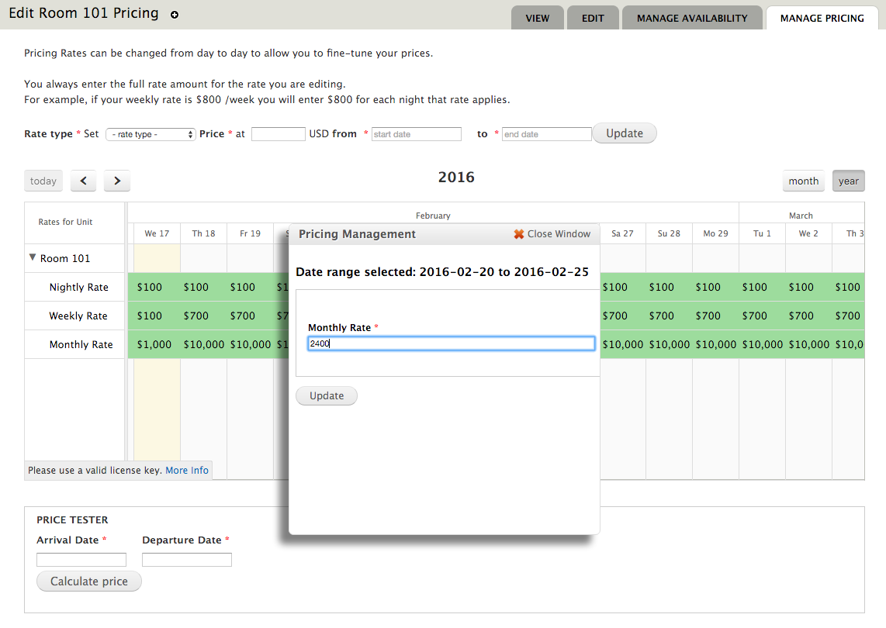
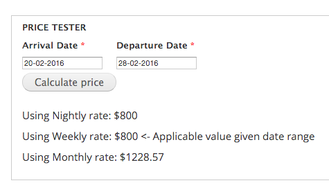
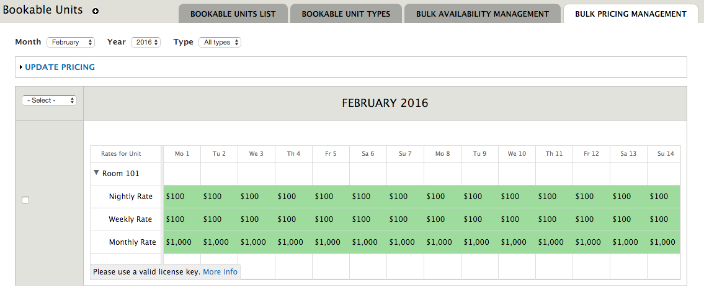

.. _weekly_monthly_pricing: Weekly/Monthly Pricing,

Roomify Periodic Pricing
========================
The Roomify Periodic Pricing module allows you to quickly define nightly, weekly and monthly rates that can change for any given date.

This is a replacement to the rooms_periodic_pricing module contained within Rooms.

Requirements
------------
1. A site with the latest version of Rooms installed. Rooms is a free open-source module available for Drupal. Read the installation instructions `here <file:///Users/Ronald/dev/docs/_build/rooms/index.html>`_.

2. The FullCalendar Scheduler JQuery library - `download here <https://github.com/fullcalendar/fullcalendar-scheduler/releases/download/v1.2.1/fullcalendar-scheduler-1.2.1.zip>`_. While FullCalendar Scheduler requires a license is required, if you purchased Roomify Periodic Pricing this license is included.

Installation
------------
1. De-activate and uninstall (if active) the rooms_periodic_pricing module.
2. Add the roomify_periodic_pricing module to your sites/all/modules directory (or any other location you are keeping your modules)
3. Unpack the FullCalendar Scheduler Library in your sites/all/libraries directory (if you use a different location we assume you know what you are doing and your Drupal site is configured appropriately). You should end up with sites/all/libraries/fullcalendar-scheduler
4. Activate the module from the Drupal module activation page.

Configuration & Usage
----------------------
1. Within the edit page of a unit set the Weekly and Monthly Rates. Weekly rates apply for bookings over 7 days and monthly rates apply for bookings over 28 dates. These are the *default* values.

2. With the default prices in place you can now manage prices over periods by visiting the "Manage Pricing" page for that unit.

3. You can set prices by using the Rate Type form or by dragging and selecting dates on the calendar.

The Price Tester
----------------------
To help identifying what prices will be charged for a given booking period the price tester can be used. It will show prices for all different rates and indicate which one will be used given the dates selected.

Bulk Pricing Management
------------------------
The Bulk Pricing Management pages also cater for bulk availability management.

If you are interested in this module please `get in touch <https://roomify.us/get-started>`_
_
